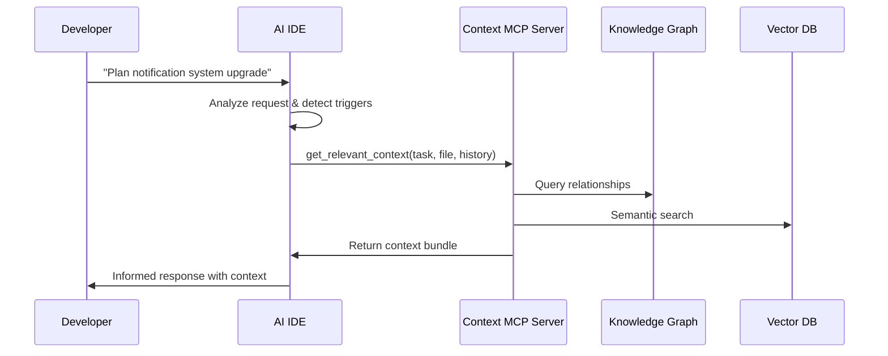

# Context-as-a-Service (CaaS) Usage Guide for AI IDEs

## Overview

Context-as-a-Service (CaaS) provides intelligent, on-demand context delivery to AI-powered IDEs like Claude Code and Windsurf. This guide explains how CaaS integrates with IDEs, manages state, and optimizes the developer experience through smart context fetching.

## Table of Contents

1. [Core Concepts](#core-concepts)
2. [Integration Architecture](#integration-architecture)
3. [State Management](#state-management)
4. [Trigger Mechanisms](#trigger-mechanisms)
5. [Explicit Context Control](#explicit-context-control)
6. [Implementation Patterns](#implementation-patterns)
7. [Best Practices](#best-practices)
8. [Future Roadmap](#future-roadmap)

## Core Concepts

### What is Context-as-a-Service?

CaaS is a pattern where an MCP (Model Context Protocol) server provides rich, relevant context to AI IDEs by:
- Maintaining a knowledge graph (Neo4j) of project architecture and relationships
- Storing embeddings in a vector database (Qdrant) for semantic search
- Implementing RAG (Retrieval-Augmented Generation) for intelligent context retrieval
- Managing state across sessions and maintaining context relevance

### The Context Challenge

AI IDEs need to know **when** to fetch context and **what** context is relevant. Without proper triggers and state management, they either:
- Fetch too much context (overwhelming the LLM and slowing responses)
- Fetch too little context (missing critical information)
- Fetch at the wrong times (interrupting flow or missing opportunities)

## Integration Architecture

### High-Level Flow



### Context Layers

1. **Passive Context** (Always Available)
   - Project structure
   - Recent file history
   - Active dependencies
   - Current file content

2. **Active Context** (Fetched on Triggers)
   - Related documentation
   - Architecture diagrams
   - Similar code patterns
   - Team conventions

3. **Deep Context** (Fetched on Demand)
   - Full knowledge graph traversal
   - Historical implementation patterns
   - Cross-project learnings
   - External documentation

## State Management

### State Distribution

State exists at multiple levels in the CaaS architecture:

#### 1. IDE-Level State
```javascript
{
  "workspace": {
    "current_file": "/src/payment/processor.py",
    "open_files": ["..."],
    "cursor_position": { "line": 42, "column": 15 },
    "recent_edits": ["..."]
  },
  "conversation": {
    "history": ["..."],
    "current_task": "implementing payment refunds",
    "mentioned_concepts": ["payment", "stripe", "webhook"]
  },
  "context_cache": {
    "payment_architecture": {
      "fetched_at": "2025-01-30T10:00:00Z",
      "ttl": 3600,
      "data": {...}
    }
  }
}
```

#### 2. MCP Server State
```javascript
{
  "sessions": {
    "session_abc123": {
      "user_id": "dev_001",
      "project_id": "ELFAutomations",
      "state": {
        "active_contexts": ["payment_system", "notification_service"],
        "query_history": [...],
        "relevance_scores": {...},
        "graph_traversal_state": {...}
      },
      "preferences": {
        "context_depth": "medium",
        "auto_refresh": true,
        "trigger_sensitivity": 0.7
      }
    }
  }
}
```

#### 3. Persistence Strategy

- **IDE State**:
  - Local SQLite for workspace data
  - In-memory for conversation (optionally persisted)
  - File-based cache for context data

- **MCP State**:
  - Redis for active sessions
  - PostgreSQL for user preferences and history
  - Neo4j for knowledge graph state
  - Qdrant for vector embeddings

## Trigger Mechanisms

### Event-Driven Triggers

```typescript
interface ContextTrigger {
  type: 'file_open' | 'code_edit' | 'task_start' | 'error' | 'explicit';
  confidence: number;  // 0-1, threshold for fetching
  scope: 'narrow' | 'medium' | 'broad';
  keywords?: string[];
  patterns?: RegExp[];
}
```

### Common Trigger Patterns

1. **File-Based Triggers**
   ```typescript
   on('file:open', async (file) => {
     if (file.path.includes('payment')) {
       await fetchContext('payment_system', { depth: 'medium' });
     }
   });
   ```

2. **Semantic Triggers**
   ```typescript
   on('conversation:message', async (message) => {
     const concepts = extractConcepts(message);
     if (concepts.includes('refactor') && concepts.includes('api')) {
       await fetchContext('api_patterns', {
         include: ['best_practices', 'existing_endpoints']
       });
     }
   });
   ```

3. **Task-Based Triggers**
   ```typescript
   on('task:created', async (task) => {
     const relevantContexts = await analyzeTaskRequirements(task);
     await fetchContextBatch(relevantContexts);
   });
   ```

### Configuring Triggers

#### In Claude Code (via CLAUDE.md)
```markdown
# CLAUDE.md
## Context Configuration

### Auto-fetch contexts when:
- Opening files in /src/payment/* - fetch payment architecture
- Using words: "refactor", "redesign", "upgrade" - fetch design patterns
- Starting new features - fetch coding standards and conventions

### Context refresh intervals:
- Architecture docs: 24 hours
- API schemas: 1 hour
- Team conventions: 1 week

### Context depth preferences:
- Default: medium (2-hop graph traversal)
- For debugging: shallow (immediate connections only)
- For architecture planning: deep (full graph traversal)
```

#### Proposed Configuration Format
```yaml
# .context-config.yaml
context:
  mcp_server: "http://localhost:3000/context"

  triggers:
    file_patterns:
      - pattern: "*/payment/*"
        context: ["payment_architecture", "stripe_integration"]
      - pattern: "*/api/*"
        context: ["api_patterns", "openapi_schemas"]

    keywords:
      - words: ["refactor", "redesign"]
        context: ["design_patterns", "best_practices"]
        confidence: 0.8

    tasks:
      - type: "feature_implementation"
        context: ["coding_standards", "similar_features"]
        depth: "deep"

  cache:
    strategy: "lru"
    max_size: "100MB"
    ttl:
      default: 3600
      architecture: 86400
      code_examples: 7200

  state:
    persistence: "workspace"
    sync: true
```

## Explicit Context Control

### Chat Commands

Users can explicitly control context through natural language commands:

#### Refresh Commands
```
"Refresh context about the payment system"
"Update your understanding of our API architecture"
"Fetch the latest database schema information"
"Clear cached context and reload"
```

#### Scoping Commands
```
"For this session, focus only on the authentication module"
"Include historical context from the last refactor"
"Limit context to files modified in the last week"
"Expand context to include related microservices"
```

#### Verification Commands
```
"What's your current understanding of our notification system?"
"When did you last fetch context about user management?"
"Show me what context you have loaded"
"List all active context sources"
```

### MCP Tool Interface

```typescript
interface ContextTools {
  // Explicit refresh with options
  refresh_context: {
    topic: string;
    depth?: 'shallow' | 'medium' | 'deep';
    force?: boolean;  // Ignore cache
    include_history?: boolean;
  };

  // Configure triggers
  set_context_triggers: {
    file_patterns?: string[];
    keywords?: string[];
    refresh_interval?: number;  // minutes
    sensitivity?: number;  // 0-1
  };

  // Query current state
  get_context_state: {
    include_cache_info?: boolean;
    include_triggers?: boolean;
    include_stats?: boolean;
  };

  // Manage context scope
  set_context_scope: {
    include_only?: string[];
    exclude?: string[];
    time_range?: { start: Date; end: Date };
    relevance_threshold?: number;
  };
}
```

### Slash Commands (Proposed)

```
/context refresh [topic]
/context clear [cache|all]
/context status
/context depth [shallow|medium|deep]
/context scope [module]
/context history
```

## Implementation Patterns

### 1. Smart Context Manager

```typescript
class SmartContextManager {
  private cache: LRUCache<string, ContextBundle>;
  private triggers: Map<string, ContextTrigger>;
  private state: SessionState;

  constructor(private mcpClient: MCPClient) {
    this.cache = new LRUCache({ max: 100, ttl: 3600 });
    this.setupDefaultTriggers();
  }

  async getContext(event: TriggerEvent): Promise<ContextBundle | null> {
    // Check relevance threshold
    const relevance = await this.assessRelevance(event);
    if (relevance < this.state.threshold) {
      return null;
    }

    // Check cache
    const cacheKey = this.getCacheKey(event);
    if (this.cache.has(cacheKey) && !event.force) {
      return this.cache.get(cacheKey);
    }

    // Determine fetch strategy
    const strategy = this.determineFetchStrategy(event, relevance);

    // Fetch context
    const context = await this.mcpClient.fetchContext({
      topic: event.topic,
      depth: strategy.depth,
      include: strategy.includes,
      session_id: this.state.sessionId
    });

    // Update cache and state
    this.cache.set(cacheKey, context);
    this.updateState(event, context);

    return context;
  }

  private determineFetchStrategy(event: TriggerEvent, relevance: number) {
    if (relevance > 0.9 || event.type === 'explicit') {
      return { depth: 'deep', includes: ['all'] };
    } else if (relevance > 0.7) {
      return { depth: 'medium', includes: ['relevant'] };
    } else {
      return { depth: 'shallow', includes: ['essential'] };
    }
  }
}
```

### 2. Context-Aware MCP Server

```typescript
class ContextMCPServer {
  private kg: Neo4jClient;
  private vdb: QdrantClient;
  private sessions: Map<string, SessionState>;

  async handleContextRequest(params: ContextRequest): Promise<ContextBundle> {
    const session = this.getOrCreateSession(params.session_id);

    // Update session state
    session.recordQuery(params);

    // Parallel fetch from multiple sources
    const [graphContext, vectorContext, historicalContext] = await Promise.all([
      this.fetchGraphContext(params),
      this.fetchVectorContext(params),
      this.fetchHistoricalContext(session, params)
    ]);

    // Merge and rank results
    const merged = this.mergeContexts(graphContext, vectorContext, historicalContext);
    const ranked = this.rankByRelevance(merged, params);

    // Apply scope and depth filters
    const filtered = this.applyFilters(ranked, params);

    // Update session state with results
    session.updateActiveContexts(filtered);

    return {
      contexts: filtered,
      metadata: {
        session_id: params.session_id,
        fetched_at: new Date(),
        sources: ['knowledge_graph', 'vector_db', 'history'],
        relevance_scores: this.getRelevanceScores(filtered)
      }
    };
  }

  private async fetchGraphContext(params: ContextRequest) {
    const query = `
      MATCH (n:Concept {name: $topic})-[r:RELATES_TO*1..${params.depth || 2}]-(related)
      WHERE related.relevance > $threshold
      RETURN n, r, related
      ORDER BY related.relevance DESC
      LIMIT 50
    `;

    return await this.kg.query(query, {
      topic: params.topic,
      threshold: params.relevance_threshold || 0.7
    });
  }
}
```

### 3. IDE Integration Layer

```typescript
class IDEContextIntegration {
  private contextManager: SmartContextManager;
  private eventEmitter: EventEmitter;

  constructor() {
    this.setupEventListeners();
    this.setupChatCommands();
  }

  private setupEventListeners() {
    // File events
    vscode.workspace.onDidOpenTextDocument(doc => {
      this.eventEmitter.emit('context:trigger', {
        type: 'file_open',
        file: doc.fileName,
        language: doc.languageId
      });
    });

    // Edit events with debouncing
    const debouncedEdit = debounce((change) => {
      this.eventEmitter.emit('context:trigger', {
        type: 'code_edit',
        file: change.document.fileName,
        changes: change.contentChanges
      });
    }, 1000);

    vscode.workspace.onDidChangeTextDocument(debouncedEdit);
  }

  private setupChatCommands() {
    // Register chat command handler
    this.on('chat:message', async (message) => {
      const contextCommands = this.parseContextCommands(message);

      for (const cmd of contextCommands) {
        switch (cmd.type) {
          case 'refresh':
            await this.handleRefresh(cmd);
            break;
          case 'scope':
            await this.handleScopeChange(cmd);
            break;
          case 'status':
            await this.handleStatusQuery(cmd);
            break;
        }
      }
    });
  }
}
```

## Best Practices

### 1. Context Hygiene

- **Regular Refresh**: Set appropriate TTLs for different context types
- **Scope Management**: Keep context focused on current task
- **Cache Warming**: Pre-fetch likely contexts during idle time
- **Cleanup**: Remove stale contexts periodically

### 2. Performance Optimization

```typescript
// Batch context requests
const contexts = await Promise.all([
  fetchContext('api_patterns'),
  fetchContext('database_schema'),
  fetchContext('coding_standards')
]);

// Use progressive loading
const immediate = await fetchContext(topic, { depth: 'shallow' });
// Show initial results
const full = await fetchContext(topic, { depth: 'deep' });
// Update with complete results
```

### 3. User Experience

- **Transparency**: Show when context is being fetched
- **Control**: Always allow manual override
- **Feedback**: Learn from user corrections
- **Performance**: Keep context fetching non-blocking

### 4. Conversation Patterns

```
// Good: Explicit context request
"Before we refactor the payment system, please refresh your understanding of our current payment architecture and recent changes."

// Good: Verification
"What context do you have about our notification system? When was it last updated?"

// Good: Scoped request
"For this debugging session, only use context from the authentication module."
```

## Future Roadmap

### Near Term (IDE Support Needed)

1. **Configuration Files**
   - Standard `.context-config.yaml` format
   - IDE-specific context preferences
   - Per-project trigger definitions

2. **UI Integration**
   - Context status indicator
   - Manual refresh button
   - Context scope selector

3. **Advanced Triggers**
   - ML-based relevance detection
   - Collaborative filtering (team patterns)
   - Time-based triggers

### Long Term (Protocol Evolution)

1. **Bi-directional Context**
   - IDE pushes context to MCP
   - Collaborative context building
   - Team-shared context sessions

2. **Context Streaming**
   - Real-time context updates
   - WebSocket-based push
   - Incremental context delivery

3. **Context Intelligence**
   - Predictive context fetching
   - Context quality metrics
   - Automated context curation

## Conclusion

Context-as-a-Service represents a paradigm shift in how AI IDEs access and utilize project knowledge. By implementing intelligent triggers, maintaining distributed state, and providing explicit control mechanisms, CaaS enables AI assistants to have the right context at the right time, dramatically improving their effectiveness.

The key to successful CaaS implementation is balancing automation with user control, ensuring performance while maintaining relevance, and creating a transparent system that developers can understand and trust.

As AI IDEs evolve, expect deeper CaaS integration with native configuration support, richer trigger mechanisms, and more sophisticated state management. The future of AI-assisted development depends on context, and CaaS provides the framework to deliver it intelligently.
