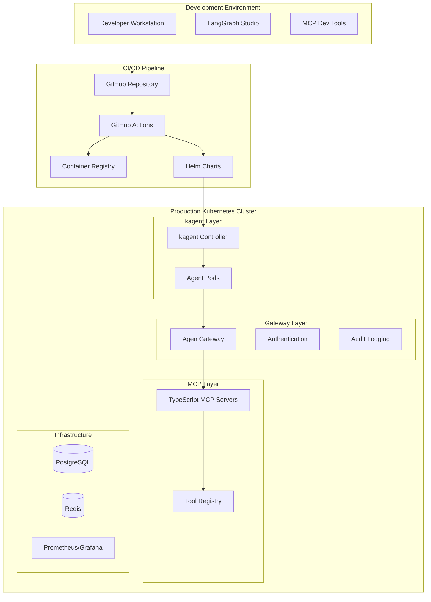

# CI/CD Pipeline Architecture for Production AI Agents
## LangGraph + MCP + kagent + AgentGateway

**Document Version:** 1.0
**Audience:** Technical Management
**Classification:** Internal Technical Architecture

---

## Executive Summary

This document outlines a CI/CD pipeline architecture specifically designed for deploying AI agents at enterprise scale. We are entering a new era where **CI/CD for AI agentic systems represents largely uncharted territory** - traditional DevOps/CloudOps practices require fundamental rethinking when applied to autonomous, stateful AI agents that make decisions and coordinate complex workflows.

This approach leverages the mature orchestration capabilities of **Kubernetes as the foundation layer**, with AI agents designed as first-class Kubernetes citizens. This allows us to **inherit years of container orchestration expertise** while pioneering new patterns for agentic system deployment. By layering our **LangGraph** agents, **TypeScript MCP servers**, **kagent** controllers, and **AgentGateway** for MCP access, authentication,and control, we enable the platform to handle scaling, rolling deployments, health management, and failure recovery using proven cloud-native patterns.

While much remains to be learned in this emerging field, this architecture provides **enterprise-grade reliability** and **operational excellence** by building upon Kubernetes' battle-tested orchestration capabilities rather than attempting to solve these challenges from scratch.

---

## The Emerging Challenge: AI Agentic System CI/CD

### Uncharted Territory in DevOps

**The New Paradigm**
CI/CD for AI agentic systems represents a fundamentally new challenge in software deployment. Unlike traditional stateless applications, AI agents are:
- **Stateful and conversational** - maintaining context across interactions
- **Autonomous decision-makers** - capable of independent reasoning and action
- **Dynamically coordinating** - collaborating with other agents in real-time
- **Learning and adapting** - evolving behavior based on interactions

**Traditional CI/CD Limitations**
Existing DevOps practices were designed for stateless, deterministic applications and fall short when applied to AI agents:
- **Static deployment models** cannot handle dynamic agent interactions
- **Traditional testing** cannot validate emergent agent behaviors
- **Standard monitoring** provides insufficient visibility into agent reasoning
- **Conventional scaling** doesn't account for agent coordination complexity

**The Learning Opportunity**
As pioneers in this space like many others, I acknowledge that **much remains to be learned** about optimal practices for agentic system deployment. However, rather than building from scratch, this approach leverages the proven foundation of Kubernetes orchestration while innovating on top of this stable platform.

---

## Solution: Kubernetes-Native AI Agent Platform

### Leveraging Proven Orchestration for New Challenges

**The Kubernetes Foundation Strategy**
Rather than reinventing orchestration for AI agents, this architecture treats **agents as first-class Kubernetes citizens**. This approach allows us to inherit many years of container orchestration expertise while pioneering new patterns specific to agentic systems:

- **Scaling & Resource Management**: Kubernetes HPA/VPA handle agent scaling based on workload
- **Rolling Deployments**: Standard Kubernetes deployment strategies for zero-downtime agent updates
- **Health Management**: Built-in liveness and readiness probes adapted for agent wellness
- **Service Discovery**: Native Kubernetes networking for agent-to-agent communication
- **Secret Management**: Kubernetes secrets and operators for secure API key handling
- **Failure Recovery**: Kubernetes controllers provide automatic agent restart and failover

**Innovation on Solid Ground**
While we may be pioneering new territory in agentic CI/CD, we're building upon Kubernetes' battle-tested foundation rather than solving orchestration challenges from scratch. This approach provides:

### Architecture Overview



### Component Responsibilities

#### 1. **LangGraph Agents** (Python)
- **Purpose**: Stateful agent workflows and multi-agent coordination
- **Kubernetes Integration**: Deployed as pods with persistent state volumes
- **Scaling Strategy**: HPA based on queue depth and response time metrics

#### 2. **TypeScript MCP Servers**
- **Purpose**: Standardized tool interfaces and business integrations
- **Kubernetes Integration**: Microservice deployments with service mesh
- **Scaling Strategy**: Independent scaling based on tool usage patterns

#### 3. **kagent Controller**
- **Purpose**: Kubernetes-native agent lifecycle management via CRDs
- **Kubernetes Integration**: Custom resource definitions for agent specifications
- **Scaling Strategy**: Declarative agent scaling through Kubernetes operators

#### 4. **AgentGateway**
- **Purpose**: Secure, governed access to MCP servers
- **Kubernetes Integration**: High-availability deployment with ingress controllers
- **Scaling Strategy**: Standard load balancing and horizontal pod autoscaling

---

## CI/CD Pipeline Architecture

### Development Workflow

#### 1. **Local Development Environment**

**LangGraph Agent Development**
```yaml
Development_Tools:
  - LangGraph Studio: "Visual workflow designer and debugger"
  - Local kagent: "minikube cluster with kagent controller"
  - MCP Inspector: "Tool for testing MCP server integrations"
  - AgentGateway Local: "Development proxy for MCP access"

Developer_Experience:
  - Hot reload: "Instant agent updates during development"
  - Visual debugging: "Step-through agent decision making"
  - Tool mocking: "Mock MCP responses for isolated testing"
  - Performance profiling: "Local resource usage analysis"
```

**TypeScript MCP Development**
```yaml
Development_Stack:
  - Node.js 18+: "Runtime environment"
  - TypeScript 5+: "Type-safe development"
  - MCP SDK: "Standard protocol implementation"
  - Jest: "Unit and integration testing"

Development_Features:
  - Auto-generation: "TypeScript types from MCP schemas"
  - Live reload: "Instant server updates"
  - Contract testing: "Validate MCP protocol compliance"
  - Performance testing: "Load testing individual tools"
```

#### 2. **Continuous Integration Pipeline**

**Stage 1: Code Quality & Testing**
```yaml
LangGraph_Agent_Pipeline:
  code_quality:
    - black: "Code formatting"
    - mypy: "Static type checking"
    - flake8: "Linting and style"
    - bandit: "Security scanning"

  testing:
    - pytest: "Unit tests with mocking"
    - integration_tests: "Agent workflow validation"
    - contract_tests: "MCP integration validation"
    - performance_tests: "Response time benchmarks"

TypeScript_MCP_Pipeline:
  code_quality:
    - prettier: "Code formatting"
    - eslint: "Linting and best practices"
    - tsc: "TypeScript compilation"
    - npm_audit: "Dependency vulnerability scanning"

  testing:
    - jest: "Unit and integration tests"
    - mcp_compliance: "Protocol adherence testing"
    - api_contract: "Schema validation testing"
    - load_testing: "Performance under load"
```

**Stage 2: Security & Compliance**
```yaml
Security_Scanning:
  - container_scanning: "Trivy for vulnerability detection"
  - secret_detection: "GitLeaks for credential scanning"
  - dependency_scanning: "Snyk for third-party vulnerabilities"
  - sast_analysis: "CodeQL for static analysis"

Compliance_Validation:
  - policy_enforcement: "OPA Gatekeeper policy validation"
  - resource_limits: "Kubernetes resource quota compliance"
  - network_policies: "Security posture validation"
  - audit_requirements: "Logging and monitoring compliance"
```

**Stage 3: Build & Package**
```yaml
Container_Building:
  multi_stage_builds:
    - builder: "Compile and test"
    - runtime: "Minimal production image"
    - security: "Non-root user, read-only filesystem"

  optimization:
    - layer_caching: "Docker BuildKit for faster builds"
    - multi_arch: "AMD64 and ARM64 support"
    - image_signing: "Cosign for supply chain security"

Helm_Packaging:
  chart_validation:
    - helm_lint: "Chart syntax validation"
    - kubeval: "Kubernetes manifest validation"
    - policy_check: "Security policy compliance"

  versioning:
    - semantic_versioning: "Automated version management"
    - chart_testing: "Deployment validation"
    - rollback_testing: "Upgrade/downgrade validation"
```

#### 3. **Continuous Deployment Pipeline**

**Stage 1: Staging Deployment**
```yaml
Automated_Deployment:
  environment_provisioning:
    - namespace_creation: "Isolated staging environment"
    - secret_management: "External secrets operator"
    - network_policies: "Micro-segmentation"

  component_deployment:
    - mcp_servers: "Deploy updated TypeScript MCP servers"
    - agentgateway: "Configure access policies"
    - kagent_agents: "Deploy LangGraph agents via CRDs"
    - monitoring: "Deploy observability stack"

Integration_Testing:
  end_to_end_validation:
    - workflow_testing: "Complete business process validation"
    - performance_testing: "Load testing with realistic scenarios"
    - security_testing: "Penetration testing and vulnerability assessment"
    - chaos_engineering: "Fault injection and resilience testing"
```

**Stage 2: Production Deployment**
```yaml
Blue_Green_Deployment:
  traffic_routing:
    - blue_environment: "Current production version"
    - green_environment: "New version deployment"
    - gradual_migration: "Canary deployment with traffic splitting"

  validation_gates:
    - health_checks: "Comprehensive health validation"
    - business_metrics: "KPI validation and monitoring"
    - error_rate_monitoring: "Automated rollback triggers"
    - performance_monitoring: "SLA compliance validation"

Rollback_Strategy:
  automated_rollback:
    - health_check_failure: "Immediate rollback on health issues"
    - error_rate_threshold: "Rollback on increased error rates"
    - performance_degradation: "Rollback on SLA violations"

  manual_rollback:
    - one_click_rollback: "Instant reversion to previous version"
    - partial_rollback: "Component-specific rollback capability"
    - data_consistency: "State management during rollbacks"
```

---

## Key Architectural Benefits

### 1. **Kubernetes-Native Agent Orchestration**

**Leveraging Proven Patterns:**
Traditional application deployment has been solved by Kubernetes - we apply these same patterns to AI agents rather than reinventing orchestration. This provides immediate benefits:
```yaml
Kubernetes_Orchestration_Benefits:
  - battle_tested_scaling: "Inherit HPA/VPA algorithms proven at scale"
  - zero_downtime_deployments: "Rolling updates with automatic rollback"
  - service_mesh_integration: "Istio for advanced traffic management"
  - resource_optimization: "Kubernetes scheduler for efficient placement"

Agent_Specific_Adaptations:
  - stateful_deployments: "StatefulSets for agents requiring persistent identity"
  - custom_health_checks: "Agent reasoning health beyond HTTP endpoints"
  - coordination_aware_scaling: "Consider agent interdependencies in scaling decisions"
  - context_preservation: "Persistent volumes for agent memory and state"

Learning_and_Evolution:
  - monitoring_agent_patterns: "Observing emergent behaviors in production"
  - scaling_pattern_discovery: "Learning optimal scaling triggers for agentic workloads"
  - failure_mode_analysis: "Understanding how agent failures differ from traditional apps"
  - performance_optimization: "Tuning Kubernetes for agent-specific workload patterns"
```

### 2. **Enterprise-Grade Security & Governance**

**Building on Kubernetes Security Primitives:**
Rather than creating custom security solutions, we extend Kubernetes' proven security model for agentic systems:
```yaml
Kubernetes_Security_Foundation:
  - rbac_integration: "Extend Kubernetes RBAC for agent permissions"
  - network_policies: "Micro-segmentation for agent communications"
  - pod_security_standards: "Enforce security contexts for agent pods"
  - secrets_management: "Native Kubernetes secrets with external operators"

AgentGateway_Enhancements:
  - centralized_policy_enforcement: "Single point for all MCP access control"
  - audit_trail_completeness: "Every agent action logged and traceable"
  - dynamic_policy_updates: "Runtime policy changes without agent restarts"
  - compliance_automation: "Built-in SOC 2, GDPR, HIPAA compliance patterns"

Emerging_Security_Patterns:
  - agent_identity_management: "Learning how to model agent identities vs user identities"
  - inter_agent_trust: "Developing trust models for agent-to-agent communication"
  - decision_auditability: "Tracing agent reasoning chains for compliance"
  - behavioral_anomaly_detection: "Identifying when agents deviate from expected patterns"
```

### 3. **Operational Excellence Through Kubernetes Maturity**

**Inheriting Cloud-Native Operations:**
By building on Kubernetes, we immediately access mature operational practices while adapting them for agentic workloads:
```yaml
Kubernetes_Operations_Inheritance:
  - gitops_workflows: "ArgoCD/Flux for declarative agent deployments"
  - prometheus_integration: "Standard metrics collection extended for agents"
  - grafana_dashboards: "Proven visualization patterns adapted for agent KPIs"
  - jaeger_tracing: "Distributed tracing for multi-agent workflows"

kagent_Kubernetes_Integration:
  - custom_resource_definitions: "Native Kubernetes API for agent management"
  - operator_pattern: "Controller reconciliation loops for agent lifecycle"
  - kubectl_compatibility: "Standard Kubernetes tooling works with agents"
  - helm_charts: "Package management for complex agent deployments"

Agentic_System_Adaptations:
  - conversation_state_monitoring: "Track agent memory and context health"
  - reasoning_performance_metrics: "Measure decision-making latency and quality"
  - coordination_pattern_analysis: "Understand emergent multi-agent behaviors"
  - adaptive_scaling_algorithms: "Learn optimal scaling patterns for different agent types"

Operational_Learning_Areas:
  - agent_failure_patterns: "How do AI agents fail differently than traditional services?"
  - capacity_planning: "What are the resource requirements for different agent workloads?"
  - performance_optimization: "Which Kubernetes features provide the most benefit for agents?"
  - troubleshooting_methodologies: "How do we debug agent reasoning issues in production?"
```

### 4. **TypeScript MCP Ecosystem on Kubernetes**

**Cloud-Native Tool Architecture:**
TypeScript MCP servers deployed as Kubernetes microservices provide the flexibility to experiment and learn in this new domain:
```yaml
Kubernetes_Microservice_Benefits:
  - independent_deployment: "Deploy and update tools without affecting agents"
  - kubernetes_service_discovery: "Native service mesh integration for tool routing"
  - standard_scaling_patterns: "HPA for tool services based on usage metrics"
  - istio_integration: "Advanced traffic management and canary deployments for tools"

TypeScript_Development_Advantages:
  - rapid_prototyping: "Quick iteration on new tool integrations"
  - type_safety: "Compile-time validation reduces runtime agent errors"
  - npm_ecosystem: "Leverage existing libraries for faster development"
  - debugging_tooling: "Excellent debugging support for production issues"

Learning_and_Experimentation:
  - tool_usage_patterns: "Understanding which tools agents use most effectively"
  - performance_characteristics: "Learning optimal resource allocation for different tool types"
  - integration_patterns: "Discovering best practices for agent-tool interactions"
  - error_handling_strategies: "Developing resilience patterns for tool failures"

Kubernetes_Native_Tool_Patterns:
  - configmap_driven_tools: "Tools that adapt behavior based on Kubernetes config"
  - secret_aware_integrations: "Tools that automatically rotate credentials"
  - pod_disruption_budgets: "Ensuring tool availability during updates"
  - resource_quotas: "Preventing tool resource consumption from affecting agents"
```

---

## Comparative Analysis: Our Approach vs. Alternatives

### Comparison Matrix

| Aspect |    Our Kubernetes-Native Approach | Traditional Monolithic | Serverless Functions | Custom Container Platform |
|--------|-----------------------| ------------------------|---------------------|---------------------------|
| **Deployment Speed**           | ⭐⭐⭐⭐⭐ | ⭐⭐     | ⭐⭐⭐⭐ | ⭐⭐⭐   |
| **Leverages Proven Patterns**  | ⭐⭐⭐⭐⭐ | ⭐⭐     | ⭐⭐⭐   | ⭐⭐     |
| **Learning Opportunity**       | ⭐⭐⭐⭐⭐ | ⭐⭐     | ⭐⭐⭐   | ⭐⭐⭐   |
| **Operational Maturity**       | ⭐⭐⭐⭐⭐ | ⭐⭐     | ⭐⭐     | ⭐⭐⭐   |
| **Ecosystem Integration**      | ⭐⭐⭐⭐⭐ | ⭐⭐     | ⭐⭐⭐   | ⭐⭐     |
| **Adaptability for Learning**  | ⭐⭐⭐⭐   | ⭐⭐     | ⭐⭐     | ⭐⭐⭐⭐ |
| **Foundation Stability**       | ⭐⭐⭐⭐⭐ | ⭐⭐⭐⭐ | ⭐⭐⭐   | ⭐⭐     |

### Detailed Comparison

#### vs. Traditional Monolithic Deployments

**Why Kubernetes-Native Wins:**
- **Proven Orchestration**: Inherit battle-tested scaling and deployment patterns rather than building custom solutions
- **Component Independence**: Update agents, tools, and gateway independently using standard Kubernetes rolling deployments
- **Operational Tooling**: Leverage existing kubectl, Helm, and GitOps tooling rather than learning custom deployment tools
- **Learning Foundation**: Build knowledge on stable Kubernetes primitives while experimenting with agentic patterns

#### vs. Serverless Function Approaches

**Why Container Orchestration Excels for Agents:**
- **Persistent Agent State**: LangGraph agents maintain conversation context across interactions, incompatible with stateless functions
- **Complex Coordination**: Multi-agent workflows require persistent connections and shared state
- **Predictable Performance**: No cold start delays with persistent agent processes
- **Kubernetes Integration**: Native service discovery and networking for agent-to-agent communication

#### vs. Custom Container Platforms

**Why Standard Kubernetes Reduces Risk:**
- **Ecosystem Maturity**: Leverage thousands of existing Kubernetes operators and tools
- **Talent Availability**: Kubernetes expertise is widespread compared to custom platforms
- **Vendor Independence**: Avoid lock-in to proprietary orchestration platforms
- **Learning Investment**: Time spent learning applies to broader Kubernetes ecosystem, not just internal tools

---

## Implementation Approach & Learning Strategy

### Building on Proven Foundations

**Kubernetes as the Stable Platform**
While AI agentic system deployment is new territory, we build upon Kubernetes' mature orchestration capabilities:

```yaml
Proven_Kubernetes_Patterns:
  - rolling_deployments: "Zero-downtime updates with automatic rollback"
  - horizontal_scaling: "HPA based on metrics, adapted for agent workloads"
  - service_discovery: "Native networking for agent-to-agent communication"
  - resource_management: "Requests/limits tuned for agent resource patterns"
  - health_monitoring: "Liveness/readiness probes extended for agent wellness"

Learning_Areas_for_Agentic_Systems:
  - optimal_agent_resource_allocation: "CPU/memory patterns for reasoning workloads"
  - scaling_trigger_optimization: "When to scale agents vs when to scale tools"
  - inter_agent_coordination_patterns: "How agents communicate most effectively"
  - failure_recovery_strategies: "Agent-specific failure modes and recovery"
  - performance_optimization: "Kubernetes tuning for agentic workloads"
```

### Iterative Learning and Adaptation

**Phase-Based Learning Approach:**
```yaml
Foundation_Phase:
  focus: "Establish Kubernetes deployment patterns for basic agents"
  learning: "How do AI agents behave as Kubernetes workloads?"
  metrics: "Resource usage, scaling patterns, basic performance"

Scaling_Phase:
  focus: "Multi-agent coordination and complex workflows"
  learning: "How do agents coordinate at scale? What are the bottlenecks?"
  metrics: "Inter-agent latency, coordination success rates, system throughput"

Optimization_Phase:
  focus: "Performance tuning and cost optimization"
  learning: "Optimal resource allocation and scaling strategies"
  metrics: "Cost per agent operation, resource efficiency, performance optimization"

Innovation_Phase:
  focus: "Advanced patterns and capabilities"
  learning: "Emerging best practices for agentic system deployment"
  metrics: "Developer productivity, operational efficiency, business impact"
```

---

## Business Impact & Strategic Value

### The Learning Investment Advantage

**Building Future-Ready Capabilities**
By investing in Kubernetes-native AI agent deployment now, we position ourselves as leaders in an emerging field while building on proven foundations:

```yaml
Immediate_Benefits:
  - operational_maturity: "Inherit decades of container orchestration expertise"
  - ecosystem_leverage: "Use existing Kubernetes tools and patterns"
  - talent_utilization: "Apply existing Kubernetes skills to new domain"
  - risk_mitigation: "Build on battle-tested orchestration platform"

Strategic_Learning_Value:
  - first_mover_advantage: "Develop expertise in emerging agentic deployment patterns"
  - platform_foundation: "Establish reusable infrastructure for future AI initiatives"
  - operational_intelligence: "Understand how AI agents behave in production"
  - competitive_differentiation: "Advanced deployment capabilities vs traditional approaches"

Long_Term_Competitive_Position:
  - market_leadership: "Pioneer in production AI agent deployment"
  - technology_expertise: "Deep knowledge of agentic system operations"
  - platform_scalability: "Foundation for next-generation AI applications"
  - operational_excellence: "Proven ability to deploy AI at enterprise scale"
```

### Quantifiable Improvements Over Alternatives

**Operational Efficiency Gains:**
```yaml
Kubernetes_Inheritance_Benefits:
  - deployment_automation: "Standard GitOps workflows vs custom scripts"
  - scaling_intelligence: "Proven HPA/VPA algorithms vs manual scaling"
  - failure_recovery: "Kubernetes controllers vs custom recovery logic"
  - monitoring_integration: "Prometheus ecosystem vs custom monitoring"

Learning_and_Adaptation_Speed:
  - rapid_iteration: "Kubernetes-native patterns enable faster experimentation"
  - knowledge_transfer: "Kubernetes expertise applies across the organization"
  - ecosystem_benefits: "Leverage community innovations and best practices"
  - vendor_independence: "Avoid lock-in while building transferable expertise"
```

---

## Conclusion & Strategic Recommendations

### Pioneering with Proven Foundations

This approach to AI agentic system CI/CD represents a **strategic balance between innovation and stability**. While we acknowledge that **deploying AI agents at scale is largely uncharted territory**, our architecture leverages the mature orchestration capabilities of Kubernetes rather than attempting to solve these challenges from scratch.

**Key Strategic Advantages:**

1. **Foundation Stability**: Build on Kubernetes' battle-tested orchestration while pioneering agentic patterns
2. **Learning Investment**: Develop expertise in emerging agentic deployment patterns on proven infrastructure
3. **Ecosystem Leverage**: Inherit decades of container orchestration knowledge and tooling
4. **Risk Mitigation**: Reduce deployment risk by building on stable platform primitives
5. **Future Readiness**: Establish platform foundation for next-generation AI applications

### The Kubernetes-Native Advantage

By treating AI agents as **first-class Kubernetes citizens**, we unlock immediate operational benefits while positioning ourselves to learn and adapt in this new domain:

- **Inherit Proven Patterns**: Scaling, rolling deployments, and failure recovery work immediately
- **Leverage Existing Expertise**: Kubernetes knowledge applies directly to agent deployment
- **Access Mature Ecosystem**: Thousands of operators, tools, and best practices available
- **Enable Rapid Learning**: Stable foundation allows focus on agentic-specific patterns

### Potential Action Plan

**Immediate Priorities:**
1. **Establish Kubernetes Foundation** - Deploy kagent controller and basic infrastructure
2. **Begin Agent Experimentation** - Start with simple LangGraph agents to learn deployment patterns
3. **Implement MCP Integration** - Deploy TypeScript MCP servers as Kubernetes microservices
4. **Deploy AgentGateway** - Establish secure, governed access to tools and external systems

**Learning and Adaptation Strategy:**
- **Monitor and Measure**: Establish metrics for agent performance, resource usage, and operational patterns
- **Document Learnings**: Capture insights about agentic system behavior for future optimization
- **Iterate Rapidly**: Use Kubernetes' flexibility to experiment with different deployment patterns
- **Share Knowledge**: Contribute learnings back to the emerging agentic deployment community

**Success Indicators:**
- Successful deployment of first production AI agents on Kubernetes
- Established patterns for agent scaling and resource management
- Functional multi-agent workflows with proper coordination
- Secure, auditable access to external tools via AgentGateway
- Operational confidence in managing agentic systems at scale

This architecture positions us to sit on a solid foundation of Kubernetes orchestration.
