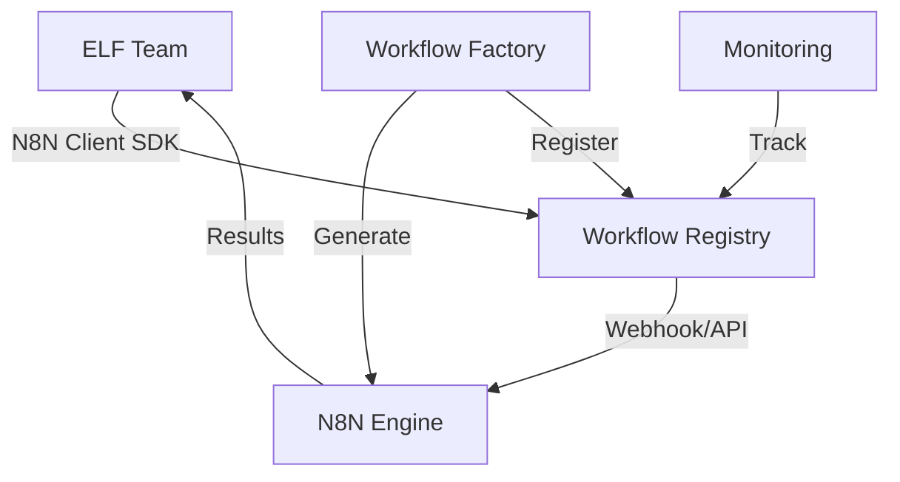

# N8N Integration Guide for ELF Teams

## Overview

N8N is integrated as a first-class capability in the ELF ecosystem, providing workflow automation that all teams can leverage through a clean SDK interface.

## Architecture



## Quick Start

### 1. Using N8N Client in Your Team

```python
from elf_automations.shared.n8n import N8NClient

async def execute_automation():
    async with N8NClient() as client:
        result = await client.execute_workflow(
            workflow_name="your-workflow-name",
            data={"key": "value"},
            team_name="your-team-name"
        )
        print(f"Result: {result.output_data}")
```

### 2. Listing Available Workflows

```python
async with N8NClient() as client:
    # List all active workflows
    workflows = await client.list_workflows()
    
    # Filter by team
    team_workflows = await client.list_workflows(owner_team="marketing-team")
    
    # Filter by category
    pipelines = await client.list_workflows(category=WorkflowCategory.DATA_PIPELINE)
```

### 3. Checking Execution History

```python
async with N8NClient() as client:
    # Get recent executions
    history = await client.get_execution_history(limit=10)
    
    # Get executions for specific workflow
    workflow_history = await client.get_execution_history(
        workflow_name="daily-report"
    )
```

## Workflow Categories

- **data-pipeline**: ETL and data processing workflows
- **integration**: System-to-system integrations
- **automation**: General automation tasks
- **notification**: Alert and notification workflows
- **approval**: Approval and review processes

## Workflow Registry Schema

### n8n_workflows Table

| Field | Type | Description |
|-------|------|-------------|
| id | UUID | Unique identifier |
| name | TEXT | Unique workflow name |
| description | TEXT | Workflow description |
| category | TEXT | Workflow category |
| owner_team | TEXT | Team that owns the workflow |
| n8n_workflow_id | TEXT | N8N internal workflow ID |
| trigger_type | TEXT | webhook, schedule, manual, event |
| webhook_url | TEXT | Webhook URL for triggering |
| input_schema | JSONB | Expected input format |
| output_schema | JSONB | Expected output format |
| is_active | BOOLEAN | Whether workflow is active |

### workflow_executions Table

| Field | Type | Description |
|-------|------|-------------|
| id | UUID | Unique execution ID |
| workflow_id | UUID | Reference to workflow |
| triggered_by | TEXT | Team that triggered execution |
| started_at | TIMESTAMP | Execution start time |
| completed_at | TIMESTAMP | Execution end time |
| status | TEXT | pending, running, success, failed |
| input_data | JSONB | Input provided |
| output_data | JSONB | Output produced |
| error_message | TEXT | Error details if failed |

## Setup Instructions

### 1. Create Registry Tables

```bash
# Run the setup script
cd scripts
python setup_n8n_registry.py

# Copy the SQL output and run in Supabase SQL Editor
```

### 2. Configure Environment

```bash
# Add to .env file
N8N_URL=http://n8n.n8n.svc.cluster.local:5678
N8N_API_KEY=your-n8n-api-key  # If authentication is enabled
SUPABASE_URL=your-supabase-url
SUPABASE_KEY=your-supabase-key
```

### 3. Test the Integration

```bash
# Run test script
cd scripts
python test_n8n_client.py

# Create a test workflow entry
python test_n8n_client.py --create-test-workflow
```

## Creating Workflows in N8N

### 1. Manual Creation

1. Access n8n UI: `http://<node-ip>:30678`
2. Create your workflow
3. Note the workflow ID
4. Register in the system using SQL or the upcoming factory

### 2. Using Workflow Factory (Coming in Phase 2)

```python
from tools.n8n_workflow_factory import N8NWorkflowFactory

factory = N8NWorkflowFactory()
workflow = factory.create_workflow(
    description="Fetch competitor data and generate report",
    team="marketing-team"
)
```

## Best Practices

### 1. Workflow Naming

- Use descriptive, kebab-case names
- Include team prefix: `marketing-competitor-analysis`
- Indicate frequency: `daily-sales-report`, `weekly-metrics`

### 2. Error Handling

```python
from elf_automations.shared.n8n import WorkflowExecutionError

try:
    result = await client.execute_workflow(...)
except WorkflowExecutionError as e:
    logger.error(f"Workflow failed: {e.workflow_name} - {e.error_message}")
    # Handle error appropriately
```

### 3. Input/Output Schemas

Always define clear schemas in the registry:

```json
// Input Schema
{
    "date_range": "string",
    "metrics": ["string"],
    "format": "string"
}

// Output Schema
{
    "report_url": "string",
    "summary": "object",
    "generated_at": "string"
}
```

### 4. Monitoring

- Check execution history regularly
- Monitor success rates
- Set up alerts for failures

## Integration Examples

### 1. CrewAI Integration

```python
from crewai import Agent
from elf_automations.shared.n8n import N8NClient

class DataAgent(Agent):
    async def process_data(self, data):
        async with N8NClient() as client:
            result = await client.execute_workflow(
                "data-processing-pipeline",
                data,
                self.role
            )
        return result.output_data
```

### 2. Scheduled Reports

```python
# In your team's workflow
async def generate_weekly_report():
    async with N8NClient() as client:
        result = await client.execute_workflow(
            "weekly-team-metrics",
            {"week": datetime.now().isocalendar()[1]},
            "executive-team"
        )
    # Process and distribute report
```

### 3. Event-Driven Automation

```python
# Triggered by external events
async def on_new_customer(customer_data):
    async with N8NClient() as client:
        # Trigger onboarding workflow
        await client.execute_workflow(
            "customer-onboarding",
            customer_data,
            "sales-team"
        )
```

## Troubleshooting

### Common Issues

1. **Workflow Not Found**
   - Check workflow is registered in registry
   - Verify workflow name matches exactly
   - Ensure workflow is active

2. **Execution Timeout**
   - Increase timeout parameter
   - Check n8n workflow for long-running nodes
   - Consider async execution pattern

3. **Connection Errors**
   - Verify N8N_URL is correct
   - Check network connectivity
   - Ensure n8n service is running

### Debug Mode

```python
import logging
logging.basicConfig(level=logging.DEBUG)

# This will show detailed request/response logs
```

## Security Considerations

1. **API Keys**: Store securely in environment variables
2. **Webhook URLs**: Use internal cluster URLs when possible
3. **Input Validation**: Always validate input against schema
4. **Access Control**: Workflows owned by teams, respect boundaries

## Next Steps

1. **Phase 2**: Workflow Factory implementation
2. **Phase 3**: N8N Interface Team creation
3. **Phase 4**: Advanced workflow composition

## Support

- N8N Documentation: https://docs.n8n.io
- ELF Integration Issues: Create issue in GitHub
- N8N UI Access: `http://<node-ip>:30678`