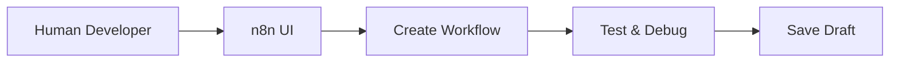
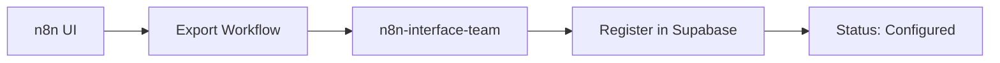
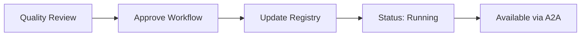

# n8n UI Integration Strategy

## Overview
This document outlines how we preserve and enhance the n8n UI experience while integrating it into ElfAutomations' autonomous architecture.

## UI Access Patterns

### 1. Direct Human Access
**URL**: `http://n8n.elf-automations.local`
**Users**: Workflow engineers, developers, operations team

**Use Cases**:
- Visual workflow development
- Testing and debugging
- Template creation
- Performance monitoring
- Manual intervention when needed

### 2. Programmatic Access (via n8n-interface-team)
**Protocol**: A2A (Agent-to-Agent)
**Users**: AI Teams

**Use Cases**:
- Automated workflow triggering
- Status monitoring
- Result retrieval
- Error handling

## Workflow Lifecycle Management

### Phase 1: Development (UI-Driven)


### Phase 2: Registration (Hybrid)


### Phase 3: Activation (Automated)


## Registry States and UI Visibility

### Workflow States
| Status | UI Visibility | A2A Available | Description |
|--------|--------------|---------------|-------------|
| `draft` | ✓ Editable | ✗ | Under development |
| `testing` | ✓ Read-only | ✗ | Being validated |
| `configured` | ✓ Read-only | ✗ | Approved, not active |
| `running` | ✓ Monitor-only | ✓ | Active in production |
| `paused` | ✓ Editable | ✗ | Temporarily disabled |
| `deprecated` | ✓ Archive view | ✗ | Historical reference |

## Implementation Details

### 1. Workflow Registration Process
```python
# After creating workflow in n8n UI:

# 1. Get workflow details from n8n
workflow_data = n8n_api.get_workflow(workflow_id)

# 2. Register with n8n-interface-team
await a2a_client.send_task({
    "to": "n8n-interface-team",
    "task": "register_workflow",
    "data": {
        "n8n_workflow_id": workflow_data["id"],
        "name": workflow_data["name"],
        "webhook_url": workflow_data["webhook_url"],
        "input_schema": extract_input_schema(workflow_data),
        "category": "customer_onboarding",
        "owner_team": "sales-team"
    }
})
```

### 2. Workflow Execution Flow
```python
# AI Team triggers workflow
response = await a2a_client.send_task({
    "to": "n8n-interface-team",
    "task": "execute_workflow",
    "workflow_name": "customer_onboarding",
    "data": {
        "customer_id": "12345",
        "plan_type": "premium"
    }
})

# Response includes execution tracking
{
    "execution_id": "exec-789",
    "status": "running",
    "tracking_url": "http://n8n.elf-automations.local/execution/789"
}
```

### 3. UI Enhancement Ideas

#### Workflow Dashboard Extension
Create a custom n8n node that automatically registers workflows:
```javascript
// Custom n8n node: "Register with ElfAutomations"
{
    name: 'RegisterWorkflow',
    properties: {
        category: ['customer', 'order', 'reporting'],
        owner_team: 'dropdown-of-teams',
        allowed_teams: 'multi-select-teams',
        auto_activate: 'boolean'
    }
}
```

#### Status Indicators
Add visual indicators in n8n UI showing:
- Registry status (draft/running/etc)
- Recent execution metrics
- Current error rate
- Teams using this workflow

## Security and Access Control

### 1. UI Access Levels
- **Admin**: Full access to all workflows
- **Developer**: Create/edit own team's workflows
- **Operator**: Monitor and manual trigger only
- **Viewer**: Read-only access to metrics

### 2. Workflow Permissions
Stored in Supabase `workflow_registry`:
```sql
-- Example permission check
SELECT * FROM workflow_registry
WHERE n8n_workflow_id = 'abc-123'
  AND ('sales-team' = ANY(allowed_teams) OR owner_team = 'sales-team')
  AND status = 'running';
```

### 3. Audit Trail
All workflow changes tracked:
- Who created/modified
- When changes occurred
- What was changed
- Why (approval notes)

## Monitoring and Observability

### 1. UI-Based Monitoring
- n8n's built-in execution history
- Visual debugging tools
- Real-time execution view

### 2. System-Wide Monitoring
Via n8n-interface-team dashboards:
- Aggregated metrics across all workflows
- Team usage patterns
- Cost analysis
- Performance trends

### 3. Alerting
- UI alerts for manual intervention needed
- A2A alerts for automated response
- Supabase triggers for metric thresholds

## Best Practices

### 1. Workflow Development
- Always start in n8n UI for visual design
- Test thoroughly before registration
- Document expected inputs/outputs
- Use consistent naming conventions

### 2. Registration Guidelines
- Only register tested, stable workflows
- Provide clear descriptions
- Define proper categories
- Set appropriate team permissions

### 3. Maintenance
- Regular review of workflow performance
- Archive deprecated workflows
- Update schemas when inputs change
- Monitor error patterns

## Future Enhancements

### 1. Bi-directional Sync
- Auto-sync workflow changes to registry
- Push registry metadata to n8n
- Version control integration

### 2. AI-Assisted Development
- AI teams suggest workflow improvements
- Automatic workflow generation from requirements
- Pattern detection across workflows

### 3. Advanced UI Features
- ElfAutomations sidebar in n8n
- One-click registration
- Team permission management
- Cost estimation per execution

## Conclusion

By maintaining full n8n UI access while adding programmatic control through the n8n-interface team, we get the best of both worlds:
- **Humans** use the intuitive UI for development and debugging
- **AI Teams** use A2A for automated execution
- **Supabase** provides unified tracking and governance
- **Everyone** benefits from shared metrics and insights

This hybrid approach ensures that as the system scales, we maintain both the flexibility for human creativity and the reliability of automated operations.