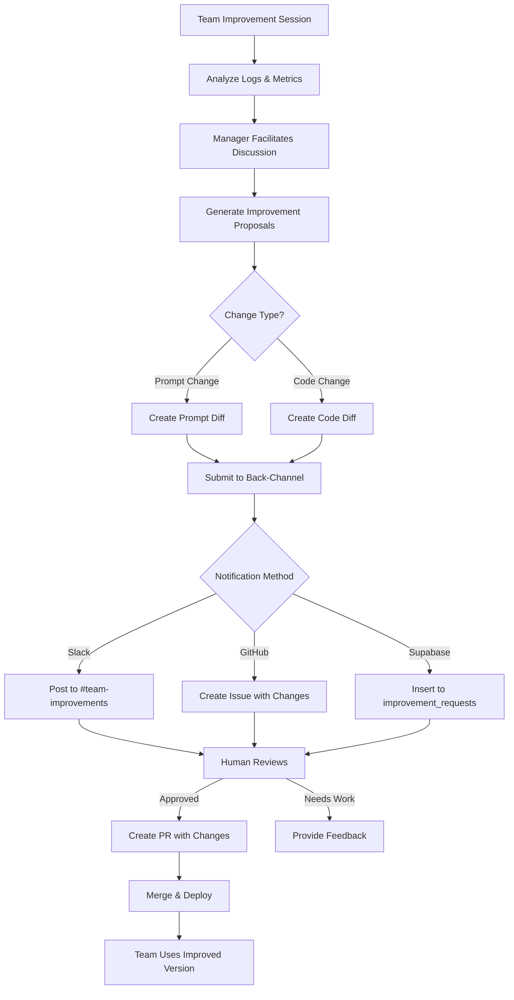

# Team Self-Improvement Architecture

## Vision
Teams analyze their logged natural language interactions, discuss effectiveness, and propose improvements to their own prompts, roles, and code - creating a true learning system.

## The Challenge
- **Source of Truth**: Code lives in Git on dev machine
- **Runtime Reality**: Teams evolve in production
- **GitOps Principle**: All changes must flow through Git

## Proposed Architecture

### 1. Team Improvement Loop

```python
# teams/marketing-team/improvement_cycle.py
class TeamImprovementCycle:
    def __init__(self, team_name):
        self.team_name = team_name
        self.manager = self.get_manager_agent()
        self.conversation_log_path = f"/logs/{team_name}_conversations.log"

    async def run_improvement_session(self):
        # 1. Analyze recent conversations
        insights = await self.analyze_team_effectiveness()

        # 2. Manager leads discussion
        improvement_plan = await self.manager.facilitate_discussion(
            "Based on our recent performance, how can we improve?",
            team_insights=insights
        )

        # 3. Generate specific changes
        changes = await self.generate_improvement_changes(improvement_plan)

        # 4. Create improvement request
        await self.submit_improvement_request(changes)
```

### 2. Change Types

#### A. Prompt/Role Refinement
```python
{
    "type": "prompt_refinement",
    "agent": "content_creator",
    "current_prompt": "You are a content creator...",
    "proposed_prompt": "You are a strategic content creator who focuses on SEO...",
    "rationale": "Analysis shows we miss SEO opportunities in 73% of content"
}
```

#### B. Code Modification
```python
{
    "type": "code_modification",
    "agent": "market_researcher",
    "file": "agents/market_researcher.py",
    "current_code": "def analyze_market(self, segment):\n    return basic_analysis(segment)",
    "proposed_code": "def analyze_market(self, segment):\n    # Add competitor analysis\n    competitors = self.get_competitors(segment)\n    return enhanced_analysis(segment, competitors)",
    "rationale": "We keep missing competitor moves"
}
```

### 3. Back-Channel Options

#### Option A: Slack Integration (Simple)
```python
# teams/shared/improvement_notifier.py
import slack_sdk

class ImprovementNotifier:
    def __init__(self):
        self.slack = slack_sdk.WebClient(token=os.environ["SLACK_BOT_TOKEN"])
        self.channel = "#team-improvements"

    async def notify_improvement_request(self, team_name, changes):
        blocks = self._format_improvement_request(team_name, changes)

        response = await self.slack.chat_postMessage(
            channel=self.channel,
            blocks=blocks,
            text=f"Team {team_name} requests improvements"
        )

        # Thread for discussion
        thread_ts = response['ts']
        return thread_ts
```

#### Option B: GitHub Issues (Traceable)
```python
# teams/shared/github_improvement.py
from github import Github

class GitHubImprovementRequester:
    def __init__(self):
        self.github = Github(os.environ["GITHUB_TOKEN"])
        self.repo = self.github.get_repo("bryansparks/ELFAutomations")

    async def create_improvement_issue(self, team_name, changes):
        title = f"[Self-Improvement] {team_name} requests changes"

        body = self._format_issue_body(changes)

        issue = self.repo.create_issue(
            title=title,
            body=body,
            labels=["team-improvement", "automated", team_name]
        )

        return issue.number
```

#### Option C: Dedicated Improvement Queue (Supabase)
```sql
-- Improvement requests table
CREATE TABLE team_improvement_requests (
    id UUID PRIMARY KEY DEFAULT gen_random_uuid(),
    team_name TEXT NOT NULL,
    request_type TEXT NOT NULL, -- 'prompt' or 'code'
    agent_name TEXT NOT NULL,
    current_state JSONB NOT NULL,
    proposed_state JSONB NOT NULL,
    rationale TEXT NOT NULL,
    effectiveness_metrics JSONB,
    status TEXT DEFAULT 'pending', -- pending, approved, rejected, implemented
    created_at TIMESTAMP DEFAULT NOW(),
    reviewed_at TIMESTAMP,
    implemented_at TIMESTAMP,
    reviewer_notes TEXT
);

-- Improvement metrics
CREATE TABLE team_effectiveness_metrics (
    id UUID PRIMARY KEY DEFAULT gen_random_uuid(),
    team_name TEXT NOT NULL,
    metric_date DATE NOT NULL,
    tasks_completed INTEGER,
    average_completion_time INTERVAL,
    collaboration_score FLOAT,
    error_rate FLOAT,
    improvement_suggestions INTEGER,
    UNIQUE(team_name, metric_date)
);
```

### 4. Complete Workflow



### 5. Implementation Example

```python
# teams/marketing-team/agents/manager.py
class MarketingManager(Agent):
    async def facilitate_improvement_session(self):
        # 1. Get team's recent performance
        logs = self.read_conversation_logs(days=7)
        metrics = self.get_team_metrics()

        # 2. Analyze effectiveness
        analysis_prompt = f"""
        Analyze our team's performance over the last week:

        Logs: {logs[-1000:]}  # Last 1000 lines
        Metrics: {metrics}

        Identify:
        1. What we did well
        2. Where we struggled
        3. Specific improvements needed
        """

        insights = await self.llm.analyze(analysis_prompt)

        # 3. Lead team discussion
        discussion = await self.crew.discuss(
            "Team improvement session",
            context=insights
        )

        # 4. Generate concrete proposals
        proposals = []

        for agent in self.crew.agents:
            if agent.needs_improvement(insights):
                proposal = await self.generate_improvement_proposal(
                    agent=agent,
                    insights=insights,
                    discussion=discussion
                )
                proposals.append(proposal)

        # 5. Submit via back-channel
        if proposals:
            await self.submit_improvements(proposals)
```

### 6. Safe Code Modification

```python
# teams/shared/safe_code_modifier.py
class SafeCodeModifier:
    """Ensures code changes are safe and valid"""

    ALLOWED_MODIFICATIONS = [
        'update_prompt',
        'add_tool',
        'modify_backstory',
        'adjust_parameters',
        'add_validation',
        'improve_error_handling'
    ]

    def validate_code_change(self, current_code, proposed_code):
        # 1. Parse both versions
        current_ast = ast.parse(current_code)
        proposed_ast = ast.parse(proposed_code)

        # 2. Check for dangerous operations
        if self._contains_dangerous_ops(proposed_ast):
            return False, "Contains potentially dangerous operations"

        # 3. Ensure core structure maintained
        if not self._maintains_interface(current_ast, proposed_ast):
            return False, "Changes break the agent interface"

        # 4. Validate syntax
        try:
            compile(proposed_code, '<string>', 'exec')
        except SyntaxError as e:
            return False, f"Syntax error: {e}"

        return True, "Changes appear safe"
```

### 7. Feedback Loop Closure

```python
# After changes are deployed
class ImprovementVerifier:
    async def verify_improvement(self, team_name, improvement_id):
        # Wait for team to use new version
        await asyncio.sleep(86400)  # 24 hours

        # Compare metrics
        before_metrics = self.get_metrics_before(improvement_id)
        after_metrics = self.get_metrics_after(improvement_id)

        improvement = calculate_improvement(before_metrics, after_metrics)

        # Record result
        await self.record_improvement_result(
            improvement_id=improvement_id,
            improvement_percentage=improvement,
            was_effective=improvement > 0
        )

        # If improvement worked, consider similar changes for other teams
        if improvement > 10:  # 10% improvement
            await self.suggest_to_similar_teams(improvement_id)
```

## Benefits

1. **Continuous Learning**: Teams improve based on real experience
2. **Maintains GitOps**: All changes flow through Git
3. **Human Oversight**: Critical changes reviewed before deployment
4. **Measurable Impact**: Track if improvements actually help
5. **Cross-Team Learning**: Successful improvements can spread

## Recommended Implementation Order

1. **Phase 1**: Slack notifications for prompt changes only
2. **Phase 2**: Add GitHub issue creation with diffs
3. **Phase 3**: Enable safe code modifications
4. **Phase 4**: Add Supabase queue with dashboard
5. **Phase 5**: Automatic PR creation for approved changes

## Security Considerations

- No direct Git access from production
- All code changes validated before submission
- Human approval required for code changes
- Audit trail of all modifications
- Rate limiting on improvement requests

This creates a true learning organization where teams evolve based on experience!
