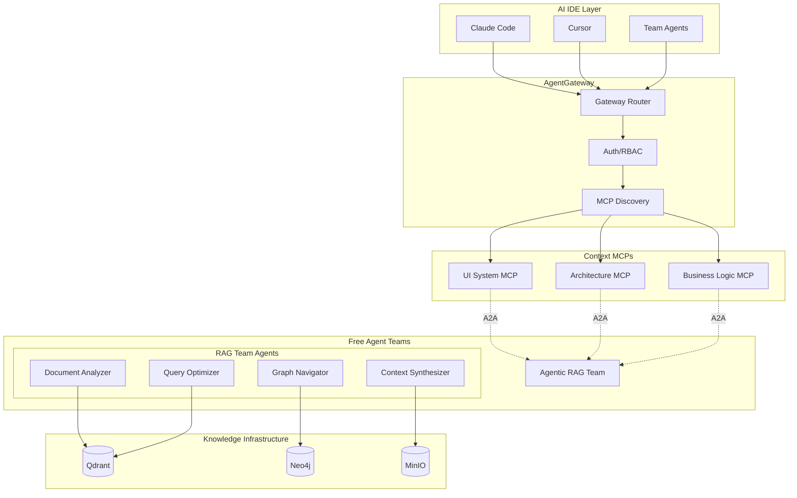

# Context MCP Integration with AgentGateway & Agentic RAG Team

## Architecture Overview

Context MCPs integrate with ElfAutomations through AgentGateway and communicate with the Agentic RAG Team via A2A protocol, maintaining strict MCP compliance.



## Agentic RAG as a Free Agent Team

The Agentic RAG system is implemented as a specialized "free agent" team that provides knowledge retrieval services to other teams and MCPs.

### 1. RAG Team Structure

```python
# teams/agentic-rag-team/crew.py
from crewai import Agent, Crew, Task
from elf_automations.shared.utils.llm_factory import LLMFactory

class AgenticRAGCrew:
    """Free agent team specializing in knowledge retrieval and synthesis."""

    def __init__(self):
        self.llm = LLMFactory.create_llm(
            provider="anthropic",
            model="claude-3-opus-20240229"
        )

        # Team members with specialized roles
        self.document_analyzer = Agent(
            role="Document Analyzer",
            goal="Extract and analyze information from vector stores",
            backstory="Expert in semantic search and document understanding",
            llm=self.llm,
            tools=[
                QdrantSearchTool(),
                DocumentChunkingTool(),
                EmbeddingTool()
            ]
        )

        self.graph_navigator = Agent(
            role="Graph Navigator",
            goal="Traverse knowledge graphs to find relationships",
            backstory="Specialist in graph databases and relationship mapping",
            llm=self.llm,
            tools=[
                Neo4jQueryTool(),
                GraphTraversalTool(),
                EntityExtractionTool()
            ]
        )

        self.context_synthesizer = Agent(
            role="Context Synthesizer",
            goal="Combine multiple sources into coherent context",
            backstory="Expert at merging vector and graph results",
            llm=self.llm,
            tools=[
                ContextMergingTool(),
                RelevanceRankingTool(),
                SummaryGenerationTool()
            ]
        )

        self.query_optimizer = Agent(
            role="Query Optimizer",
            goal="Optimize queries for best results",
            backstory="Specialist in query planning and optimization",
            llm=self.llm,
            is_manager=True,  # Manages the team
            tools=[
                QueryPlanningTool(),
                CacheManagementTool()
            ]
        )

    def create_crew(self):
        return Crew(
            agents=[
                self.query_optimizer,
                self.document_analyzer,
                self.graph_navigator,
                self.context_synthesizer
            ],
            hierarchical=True,
            manager_agent=self.query_optimizer
        )
```

### 2. A2A Interface for RAG Team

```python
# teams/agentic-rag-team/team_server.py
from fastapi import FastAPI
from elf_automations.shared.a2a.server import A2AServer

app = FastAPI()
a2a_server = A2AServer(team_name="agentic-rag-team")

@app.post("/task")
async def handle_task(task_request: dict):
    """Handle A2A task requests for knowledge retrieval."""

    task_type = task_request.get("action")
    parameters = task_request.get("parameters", {})

    if task_type == "retrieve_context":
        # Create crew and execute knowledge retrieval
        crew = AgenticRAGCrew().create_crew()

        # Define the retrieval task
        retrieval_task = Task(
            description=f"""
            Retrieve relevant context for: {parameters.get('query')}
            Collection: {parameters.get('collection')}
            Use graph enhancement: {parameters.get('use_graph', True)}
            Context window: {parameters.get('context_size', 'medium')}
            """,
            expected_output="Structured context with sources and confidence scores"
        )

        # Execute through crew
        result = crew.kickoff(inputs={"task": retrieval_task})

        return {
            "status": "success",
            "result": {
                "context": result.output,
                "sources": result.sources,
                "confidence": result.confidence,
                "graph_insights": result.graph_data
            }
        }

    elif task_type == "index_knowledge":
        # Handle indexing requests
        return await handle_indexing(parameters)

    elif task_type == "update_graph":
        # Handle graph updates
        return await handle_graph_update(parameters)

    else:
        return {"status": "error", "message": f"Unknown task type: {task_type}"}

@app.get("/capabilities")
async def get_capabilities():
    """Advertise team capabilities."""
    return {
        "team": "agentic-rag-team",
        "capabilities": [
            "retrieve_context",
            "index_knowledge",
            "update_graph",
            "semantic_search",
            "relationship_mapping"
        ],
        "supported_collections": [
            "ui_system_docs",
            "architecture_patterns",
            "business_rules",
            "team_knowledge"
        ]
    }
```

## Context MCP Implementation

### 1. Standard MCP with A2A Client

```typescript
// ui-system-mcp/src/server.ts
import { Server } from "@modelcontextprotocol/sdk/server/index.js";
import { A2AClient } from "./clients/a2a-client.js";

export class UISystemContextMCP {
  private server: Server;
  private a2aClient: A2AClient;

  constructor() {
    this.server = new Server({
      name: "ui-system-context",
      version: "1.0.0"
    }, {
      capabilities: {
        tools: {},
        resources: {}
      }
    });

    // Initialize A2A client for RAG team communication
    this.a2aClient = new A2AClient({
      sourceName: "ui-system-context-mcp",
      targetTeam: "agentic-rag-team",
      endpoint: process.env.RAG_TEAM_ENDPOINT || "http://agentic-rag-team.elf-teams:8080"
    });

    this.setupHandlers();
  }

  private async searchPatterns(args: any) {
    // Prepare A2A task for RAG team
    const task = {
      action: "retrieve_context",
      parameters: {
        query: args.query,
        collection: "ui_system_docs",
        use_graph: true,
        filters: {
          category: args.category,
          component_type: args.componentType
        },
        context_size: "large" // More context for design patterns
      }
    };

    // Send via A2A and await response
    const response = await this.a2aClient.sendTask(task);

    if (response.status !== "success") {
      throw new Error(`RAG retrieval failed: ${response.message}`);
    }

    // Transform A2A response to MCP format
    return {
      content: [{
        type: "text",
        text: this.formatRAGResponse(response.result)
      }]
    };
  }

  private formatRAGResponse(ragResult: any): string {
    let formatted = `# ${ragResult.context.title || 'Search Results'}\n\n`;

    // Add main context
    formatted += ragResult.context.content + '\n\n';

    // Add sources
    if (ragResult.sources?.length > 0) {
      formatted += '## Sources\n';
      ragResult.sources.forEach((source: any) => {
        formatted += `- ${source.title} (confidence: ${source.confidence})\n`;
      });
      formatted += '\n';
    }

    // Add graph insights if available
    if (ragResult.graph_insights) {
      formatted += '## Related Concepts\n';
      ragResult.graph_insights.forEach((insight: any) => {
        formatted += `- ${insight.concept}: ${insight.relationship}\n`;
      });
    }

    return formatted;
  }
}
```

### 2. A2A Client Implementation

```typescript
// ui-system-mcp/src/clients/a2a-client.ts
export class A2AClient {
  private sourceName: string;
  private targetTeam: string;
  private endpoint: string;

  constructor(config: A2AConfig) {
    this.sourceName = config.sourceName;
    this.targetTeam = config.targetTeam;
    this.endpoint = config.endpoint;
  }

  async sendTask(task: any): Promise<A2AResponse> {
    const a2aMessage = {
      source: this.sourceName,
      target: this.targetTeam,
      timestamp: new Date().toISOString(),
      task: task,
      context: {
        request_id: this.generateRequestId(),
        timeout: 30000 // 30 second timeout for RAG queries
      }
    };

    try {
      const response = await fetch(`${this.endpoint}/task`, {
        method: 'POST',
        headers: {
          'Content-Type': 'application/json',
          'X-A2A-Source': this.sourceName
        },
        body: JSON.stringify(a2aMessage)
      });

      if (!response.ok) {
        throw new Error(`A2A request failed: ${response.statusText}`);
      }

      return await response.json();
    } catch (error) {
      // Fallback handling
      return {
        status: "error",
        message: error.message,
        fallback: true
      };
    }
  }
}
```

## AgentGateway Integration

### 1. MCP Registration with Team Affinity

```python
# elf_automations/shared/mcp/discovery.py
class MCPDiscoveryService:
    def __init__(self):
        self.registry = {}
        self.team_dependencies = {}  # Track which teams MCPs depend on

    async def register_mcp(self, mcp_config: dict):
        """Register MCP with gateway."""
        mcp_id = mcp_config['name']

        # Track team dependencies for context MCPs
        if mcp_config.get('type') == 'context-provider':
            self.team_dependencies[mcp_id] = {
                'primary': 'agentic-rag-team',
                'fallback': mcp_config.get('fallback_team')
            }

        # Validate and store
        self.registry[mcp_id] = {
            **mcp_config,
            'registered_at': datetime.now(),
            'capabilities': await self.probe_capabilities(mcp_config['endpoint'])
        }
```

## Benefits of RAG as a Free Agent Team

### 1. **Organizational Alignment**
- RAG team follows same patterns as other teams
- Uses standard A2A communication
- Can be managed, monitored, and evolved like any team

### 2. **Flexibility**
- RAG team can have its own evolution cycle
- Can be enhanced with new agents/capabilities
- Easy to add specialized knowledge domains

### 3. **Scalability**
- Team can scale independently
- Multiple RAG teams for different domains
- Load balancing through team replication

### 4. **Accountability**
- Clear ownership of knowledge retrieval
- Audit trail through A2A messages
- Performance metrics per team

## Implementation Roadmap

### Phase 1: Create Agentic RAG Team
```bash
# Use team factory to create the RAG team
cd tools
python team_factory.py \
  --name "agentic-rag-team" \
  --description "Free agent team specializing in knowledge retrieval from Qdrant and Neo4j" \
  --department "infrastructure" \
  --framework "CrewAI"
```

### Phase 2: Deploy RAG Team
```bash
# Build and deploy
cd teams/agentic-rag-team
python make-deployable-team.py
docker build -t elf/agentic-rag-team .
kubectl apply -f k8s/
```

### Phase 3: Create Context MCPs
```bash
# Create UI system context MCP
python mcp_factory.py \
  --type context \
  --name ui-system \
  --rag-team agentic-rag-team
```

### Phase 4: Register Everything
```python
# Register RAG team and context MCPs
await gateway.register_team("agentic-rag-team")
await gateway.register_mcp("ui-system-context", depends_on="agentic-rag-team")
```

This architecture maintains clean separation while leveraging your existing team-based infrastructure!
