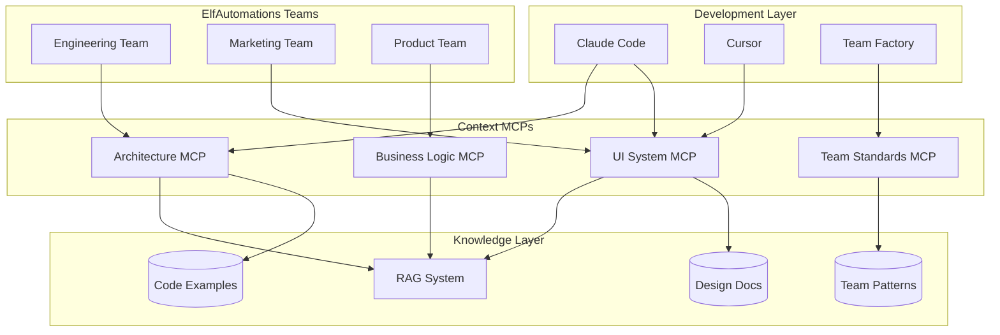

# Integrating Context MCPs with ElfAutomations

## Overview

Context MCPs provide a powerful way to ensure AI tools have consistent access to domain knowledge, design systems, and organizational standards. This document shows how to integrate this pattern into the ElfAutomations ecosystem.

## Architecture Integration



## Use Cases in ElfAutomations

### 1. Team Creation Context

When creating new teams with the Team Factory, a "Team Standards MCP" provides:

```typescript
// team-standards-mcp provides:
{
  tools: [
    "get_team_patterns",      // Best practices for team composition
    "validate_team_structure", // Check if team follows standards
    "suggest_team_members",    // AI-suggested team composition
    "get_charter_template"     // Templates for team charters
  ]
}
```

### 2. Workflow Development Context

For n8n workflow development, a "Workflow Patterns MCP" provides:

```typescript
// workflow-patterns-mcp provides:
{
  tools: [
    "get_workflow_patterns",   // Common workflow patterns
    "validate_workflow",       // Check workflow best practices
    "suggest_error_handling",  // Error handling patterns
    "get_integration_specs"    // API integration specifications
  ]
}
```

### 3. Agent Development Context

For developing individual agents, an "Agent Patterns MCP" provides:

```typescript
// agent-patterns-mcp provides:
{
  tools: [
    "get_personality_traits",  // Available personality patterns
    "get_tool_templates",      // Common agent tools
    "validate_agent_prompts",  // Prompt engineering validation
    "suggest_agent_skills"     // Skill recommendations
  ]
}
```

## Implementation Strategy

### Phase 1: Core Context Infrastructure

1. **Create Context MCP Template**
   ```bash
   # Add to mcp_factory.py
   python tools/mcp_factory.py \
     --type context \
     --name team-standards \
     --knowledge-source rag
   ```

2. **Set Up RAG Infrastructure**
   ```python
   # Enhanced Qdrant collections for context
   collections = [
     "design_system_docs",
     "team_patterns",
     "workflow_templates",
     "architecture_decisions"
   ]
   ```

3. **Index Existing Knowledge**
   ```python
   # Script to index documentation
   python scripts/index_knowledge_base.py \
     --source /docs \
     --collection team_patterns
   ```

### Phase 2: Team-Specific Context

Each team can have its own context MCP:

```yaml
# k8s/mcps/engineering-context/deployment.yaml
apiVersion: apps/v1
kind: Deployment
metadata:
  name: engineering-context-mcp
  namespace: elf-mcps
spec:
  template:
    spec:
      containers:
      - name: context-server
        env:
        - name: CONTEXT_TYPE
          value: "engineering"
        - name: KNOWLEDGE_SOURCES
          value: "code-standards,architecture-decisions"
```

### Phase 3: Dynamic Context Discovery

Teams can discover available context MCPs:

```python
# In team agents
class EngineerAgent(Agent):
    def __init__(self):
        # Discover relevant context MCPs
        self.context_mcps = self.discover_context_mcps([
            "engineering",
            "architecture",
            "code-standards"
        ])

    def get_context(self, topic: str):
        # Query appropriate context MCP
        for mcp in self.context_mcps:
            if mcp.has_knowledge(topic):
                return mcp.query(topic)
```

## Benefits for ElfAutomations

### 1. Consistent Team Creation
- All teams follow organizational patterns
- Best practices enforced automatically
- Knowledge from successful teams reused

### 2. Quality Assurance
- Automated validation of implementations
- Consistent coding standards across teams
- Design system compliance

### 3. Knowledge Preservation
- Team learnings captured in context MCPs
- Patterns evolve based on success metrics
- Institutional knowledge persists

### 4. Accelerated Development
- AI tools have immediate access to patterns
- Reduced time to implement features
- Fewer iterations needed

## Example: Creating a New Feature Team

```python
# Team Factory uses multiple context MCPs

# 1. Query team patterns
team_patterns = team_standards_mcp.get_team_patterns("feature-team")

# 2. Get architecture guidelines
arch_guidelines = architecture_mcp.get_microservice_patterns()

# 3. Get UI components for dashboard
ui_components = ui_system_mcp.suggest_components("team-dashboard")

# 4. Generate team with all context
team_spec = factory.create_team(
    description="Feature team for user analytics",
    context={
        "patterns": team_patterns,
        "architecture": arch_guidelines,
        "ui_system": ui_components
    }
)
```

## Monitoring Context Usage

Track how context MCPs improve development:

```sql
-- Supabase query to analyze context usage
SELECT
    mcp_name,
    tool_name,
    COUNT(*) as usage_count,
    AVG(response_time) as avg_response_time,
    SUM(CASE WHEN helped_resolve_issue THEN 1 ELSE 0 END) as issues_resolved
FROM context_mcp_usage
WHERE timestamp > NOW() - INTERVAL '7 days'
GROUP BY mcp_name, tool_name
ORDER BY usage_count DESC;
```

## Future Enhancements

### 1. Context Evolution
- MCPs learn from usage patterns
- Successful patterns promoted automatically
- Failed patterns deprecated

### 2. Context Chains
- MCPs can query other MCPs
- Build complex context from simple parts
- Cross-domain knowledge synthesis

### 3. Personalized Context
- Context adapts to team/developer preferences
- Learning from past interactions
- Predictive context suggestions

## Getting Started

1. **Deploy Your First Context MCP**
   ```bash
   cd examples/context-mcp/ui-system-mcp
   npm install
   npm run build
   docker build -t elf/ui-system-context-mcp .
   ```

2. **Register with AgentGateway**
   ```python
   python scripts/register_context_mcp.py \
     --name ui-system \
     --endpoint http://ui-system-mcp:8080
   ```

3. **Use in Development**
   - Configure Claude Code to use the MCP
   - Teams automatically discover and use it
   - Monitor usage and effectiveness

This Context MCP pattern transforms ElfAutomations into a learning organization where knowledge is systematically captured, validated, and made available to all AI-assisted development.
