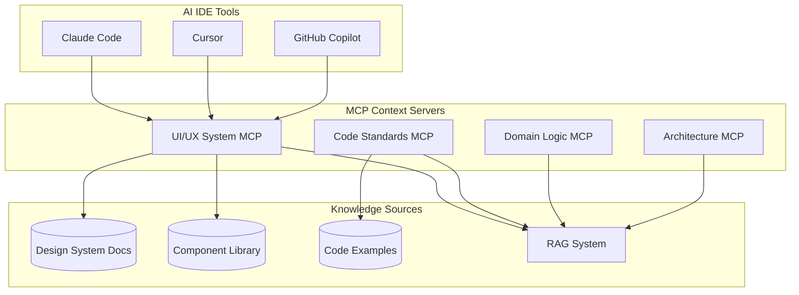

# Context MCP Pattern: Serving Domain Knowledge to AI Tools

## Overview

MCP servers can act as "Context Providers" that serve structured domain knowledge to AI IDE tools. This pattern is perfect for ensuring consistent implementation of design systems, coding standards, and domain-specific patterns.

## Architecture Pattern



## Example: UI/UX System MCP Server

### 1. Basic Structure

```typescript
// ui-system-mcp/src/server.ts
import { Server } from "@modelcontextprotocol/sdk/server/index.js";
import { StdioServerTransport } from "@modelcontextprotocol/sdk/server/stdio.js";

class UISystemMCP {
  private ragClient: RAGClient;
  private componentRegistry: ComponentRegistry;

  constructor() {
    // Initialize RAG for large documentation
    this.ragClient = new RAGClient({
      vectorStore: "qdrant",
      embeddingModel: "text-embedding-ada-002"
    });

    // Component registry for structured data
    this.componentRegistry = new ComponentRegistry();
  }

  async start() {
    const server = new Server({
      name: "ui-system-context",
      version: "1.0.0"
    }, {
      capabilities: {
        tools: {},
        resources: {}
      }
    });

    // Define tools
    server.setRequestHandler("tools/list", () => ({
      tools: [
        {
          name: "get_component_spec",
          description: "Get specifications for a UI component",
          inputSchema: {
            type: "object",
            properties: {
              component: { type: "string" }
            }
          }
        },
        {
          name: "search_design_patterns",
          description: "Search design system for patterns",
          inputSchema: {
            type: "object",
            properties: {
              query: { type: "string" },
              category: { type: "string", enum: ["layout", "color", "typography", "interaction"] }
            }
          }
        },
        {
          name: "validate_implementation",
          description: "Validate if implementation follows design system",
          inputSchema: {
            type: "object",
            properties: {
              code: { type: "string" },
              component_type: { type: "string" }
            }
          }
        },
        {
          name: "get_usage_examples",
          description: "Get examples of component usage",
          inputSchema: {
            type: "object",
            properties: {
              component: { type: "string" },
              context: { type: "string" }
            }
          }
        }
      ]
    }));

    // Define resources (static content)
    server.setRequestHandler("resources/list", () => ({
      resources: [
        {
          uri: "design://principles",
          name: "Design Principles",
          description: "Core design principles and philosophy"
        },
        {
          uri: "design://tokens",
          name: "Design Tokens",
          description: "Color, spacing, typography tokens"
        },
        {
          uri: "design://components",
          name: "Component Library",
          description: "Full component documentation"
        }
      ]
    }));
  }
}
```

### 2. RAG Integration for Large Documentation

```typescript
class RAGClient {
  async searchDocumentation(query: string): Promise<ContextResult[]> {
    // Embed the query
    const queryEmbedding = await this.embed(query);

    // Search vector store
    const results = await this.vectorStore.search({
      vector: queryEmbedding,
      limit: 5,
      includeMetadata: true
    });

    // Re-rank results based on relevance
    const reranked = await this.rerank(query, results);

    return reranked.map(r => ({
      content: r.content,
      relevance: r.score,
      source: r.metadata.source,
      context: this.expandContext(r) // Get surrounding context
    }));
  }

  private expandContext(result: SearchResult): string {
    // Get surrounding sections for better context
    return this.documentStore.getExpandedContext(
      result.documentId,
      result.chunkId,
      contextWindow: 500 // tokens before/after
    );
  }
}
```

### 3. Component Registry for Structured Data

```typescript
interface ComponentSpec {
  name: string;
  category: string;
  props: PropDefinition[];
  designTokens: string[];
  accessibility: A11yRequirements;
  examples: CodeExample[];
  bestPractices: string[];
  antiPatterns: string[];
}

class ComponentRegistry {
  async getComponentSpec(name: string): Promise<ComponentSpec> {
    // Could be from database, files, or API
    const spec = await this.db.components.findOne({ name });

    // Enrich with related information
    spec.relatedComponents = await this.findRelated(name);
    spec.usageStats = await this.getUsageStats(name);

    return spec;
  }

  async validateImplementation(code: string, componentType: string): Promise<ValidationResult> {
    const spec = await this.getComponentSpec(componentType);
    const ast = parseCode(code);

    const violations = [];

    // Check prop usage
    for (const prop of spec.props) {
      if (prop.required && !ast.hassProp(prop.name)) {
        violations.push({
          level: "error",
          message: `Missing required prop: ${prop.name}`
        });
      }
    }

    // Check design token usage
    const usedTokens = extractTokens(ast);
    for (const token of usedTokens) {
      if (!spec.designTokens.includes(token)) {
        violations.push({
          level: "warning",
          message: `Non-standard token used: ${token}`
        });
      }
    }

    return { valid: violations.length === 0, violations };
  }
}
```

## Construction Patterns for Different Context Types

### 1. Documentation Context MCP

```typescript
// For serving technical documentation, API docs, guides
class DocumentationMCP {
  tools = [
    "search_docs",        // RAG-powered search
    "get_api_reference",  // Structured API info
    "find_examples",      // Code examples
    "explain_concept"     // AI-generated explanations
  ];

  resources = [
    "docs://getting-started",
    "docs://api-reference",
    "docs://best-practices"
  ];
}
```

### 2. Code Standards MCP

```typescript
// For enforcing coding standards and patterns
class CodeStandardsMCP {
  tools = [
    "check_style",           // Linting beyond syntax
    "suggest_refactoring",   // Pattern-based suggestions
    "get_team_conventions",  // Team-specific rules
    "review_architecture"    // Architecture compliance
  ];
}
```

### 3. Domain Logic MCP

```typescript
// For business logic and domain rules
class DomainLogicMCP {
  tools = [
    "validate_business_rule",
    "get_entity_constraints",
    "check_workflow_compliance",
    "suggest_domain_patterns"
  ];
}
```

## Integration with ElfAutomations

### 1. Create Context MCP Factory

```python
# tools/context_mcp_factory.py
def create_context_mcp(context_type: str, knowledge_source: dict):
    """
    Factory for creating context-serving MCPs.

    Args:
        context_type: Type of context (ui-system, code-standards, etc.)
        knowledge_source: Configuration for knowledge source
            - type: "rag", "database", "api", "files"
            - config: Source-specific configuration
    """

    template = get_mcp_template(context_type)

    if knowledge_source["type"] == "rag":
        # Set up RAG integration
        template["rag_config"] = {
            "vector_store": "qdrant",
            "collection": f"{context_type}_docs",
            "embedding_model": "text-embedding-ada-002"
        }

    # Generate MCP with appropriate tools and resources
    return generate_mcp(template)
```

### 2. Deploy Context MCPs

```yaml
# k8s/mcps/ui-system-context/deployment.yaml
apiVersion: apps/v1
kind: Deployment
metadata:
  name: ui-system-context-mcp
spec:
  template:
    spec:
      containers:
      - name: mcp-server
        image: elf/ui-system-context-mcp:latest
        env:
        - name: QDRANT_URL
          value: "http://qdrant:6333"
        - name: KNOWLEDGE_BASE_PATH
          value: "/data/design-system"
        volumeMounts:
        - name: design-docs
          mountPath: /data/design-system
```

### 3. Register with AgentGateway

```python
# Register context MCPs for discovery
gateway_client.register_mcp({
    "name": "ui-system-context",
    "type": "context-provider",
    "category": "design-system",
    "description": "Provides UI/UX design system context",
    "endpoint": "http://ui-system-context-mcp:8080",
    "capabilities": {
        "tools": ["get_component_spec", "validate_implementation"],
        "resources": ["design://principles", "design://components"]
    }
})
```

## Benefits of This Pattern

1. **Consistent Context**: All AI tools get the same information
2. **Version Control**: Context can be versioned and updated
3. **Scalability**: RAG handles large documentation sets efficiently
4. **Validation**: Can validate implementations against standards
5. **Discovery**: AI tools can discover available context servers
6. **Customization**: Different teams can have different context servers

## Example Use Cases

### 1. UI Component Implementation
```typescript
// AI tool asks: "How do I implement a Card component?"
// MCP returns:
{
  "spec": { /* component specification */ },
  "examples": [ /* usage examples */ ],
  "tokens": { /* design tokens to use */ },
  "accessibility": { /* a11y requirements */ }
}
```

### 2. Architecture Compliance
```typescript
// AI tool asks: "Does this service follow our microservice patterns?"
// MCP analyzes and returns:
{
  "compliant": false,
  "violations": [
    "Missing health check endpoint",
    "Direct database access instead of repository pattern"
  ],
  "suggestions": [ /* how to fix */ ]
}
```

### 3. Business Logic Validation
```typescript
// AI tool asks: "What are the rules for order processing?"
// MCP returns:
{
  "rules": [ /* business rules */ ],
  "workflows": [ /* valid state transitions */ ],
  "constraints": [ /* validation rules */ ]
}
```

## Implementation Roadmap

1. **Phase 1**: Create basic context MCP template
2. **Phase 2**: Implement RAG integration for documentation
3. **Phase 3**: Add validation and compliance checking
4. **Phase 4**: Create specialized context MCPs for each domain
5. **Phase 5**: Integrate with team development workflow

This pattern turns your domain knowledge into a service that AI tools can consume, ensuring consistent, high-quality implementations across your entire codebase.
