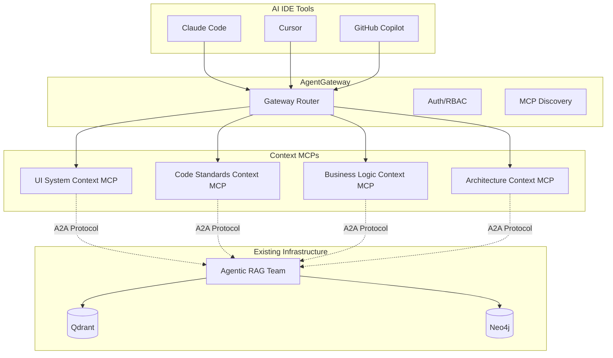

# Context-as-a-Service MCP Pattern with Existing Agentic RAG Team

## Overview

Context MCPs provide domain knowledge to AI IDE tools by leveraging the existing Agentic RAG Team through A2A protocol, all routed through AgentGateway.

## Architecture



## Context MCP Implementation

### 1. Base Context MCP with A2A Integration

```typescript
// context-mcp-base/src/base-context-mcp.ts
import { Server } from "@modelcontextprotocol/sdk/server/index.js";
import { StdioServerTransport } from "@modelcontextprotocol/sdk/server/stdio.js";
import { A2AClient } from "./a2a/client.js";

export abstract class BaseContextMCP {
  protected server: Server;
  protected a2aClient: A2AClient;
  protected contextDomain: string;
  protected collectionName: string;

  constructor(config: ContextMCPConfig) {
    this.contextDomain = config.domain;
    this.collectionName = config.qdrantCollection;

    this.server = new Server({
      name: `${config.domain}-context`,
      version: "1.0.0"
    }, {
      capabilities: {
        tools: {},
        resources: {}
      }
    });

    // Initialize A2A client to communicate with existing RAG team
    this.a2aClient = new A2AClient({
      sourceName: `${config.domain}-context-mcp`,
      targetTeam: "agentic-rag-team",
      endpoint: process.env.RAG_TEAM_ENDPOINT || "http://agentic-rag-team.elf-teams:8080"
    });

    this.setupBaseHandlers();
    this.setupDomainHandlers(); // Implemented by subclasses
  }

  private setupBaseHandlers() {
    // Common tools across all context MCPs
    this.server.setRequestHandler(CallToolRequestSchema, async (request) => {
      const { name, arguments: args } = request.params;

      switch (name) {
        case "search_context":
          return await this.searchContext(args);
        case "get_related_concepts":
          return await this.getRelatedConcepts(args);
        case "validate_against_standards":
          return await this.validateAgainstStandards(args);
        default:
          // Domain-specific tools handled by subclass
          return await this.handleDomainTool(name, args);
      }
    });
  }

  protected async searchContext(args: any) {
    // Use A2A to query the existing RAG team
    const task = {
      action: "retrieve_context",
      parameters: {
        query: args.query,
        collection: this.collectionName,
        filters: {
          domain: this.contextDomain,
          ...args.filters
        },
        use_graph_enhancement: true,
        include_relationships: true
      }
    };

    const response = await this.a2aClient.sendTask(task);

    // Transform RAG response to MCP format
    return {
      content: [{
        type: "text",
        text: this.formatContextResponse(response.result)
      }]
    };
  }

  protected abstract setupDomainHandlers(): void;
  protected abstract handleDomainTool(name: string, args: any): Promise<any>;
}
```

### 2. UI System Context MCP Implementation

```typescript
// ui-system-context-mcp/src/server.ts
import { BaseContextMCP } from "@elf/context-mcp-base";

export class UISystemContextMCP extends BaseContextMCP {
  constructor() {
    super({
      domain: "ui-system",
      qdrantCollection: "design_system_docs",
      name: "UI/UX Design System Context",
      description: "Provides UI component specs, design patterns, and validation"
    });
  }

  protected setupDomainHandlers() {
    // UI-specific tools
    this.addTool({
      name: "get_component_spec",
      description: "Get detailed component specifications",
      inputSchema: {
        type: "object",
        properties: {
          component: { type: "string", description: "Component name (e.g., Button, Card)" }
        },
        required: ["component"]
      }
    });

    this.addTool({
      name: "validate_ui_implementation",
      description: "Validate component usage against design system",
      inputSchema: {
        type: "object",
        properties: {
          code: { type: "string" },
          componentType: { type: "string" }
        },
        required: ["code"]
      }
    });

    this.addTool({
      name: "suggest_ui_patterns",
      description: "Suggest UI patterns for use cases",
      inputSchema: {
        type: "object",
        properties: {
          useCase: { type: "string" },
          constraints: { type: "array", items: { type: "string" } }
        },
        required: ["useCase"]
      }
    });
  }

  protected async handleDomainTool(name: string, args: any) {
    switch (name) {
      case "get_component_spec":
        return await this.getComponentSpec(args);
      case "validate_ui_implementation":
        return await this.validateUIImplementation(args);
      case "suggest_ui_patterns":
        return await this.suggestUIPatterns(args);
      default:
        throw new Error(`Unknown tool: ${name}`);
    }
  }

  private async getComponentSpec(args: any) {
    // Query RAG for component documentation
    const task = {
      action: "retrieve_context",
      parameters: {
        query: `${args.component} component specification props examples usage`,
        collection: "design_system_docs",
        filters: {
          type: "component_spec",
          component_name: args.component
        },
        use_graph_enhancement: true,
        return_format: "structured"
      }
    };

    const response = await this.a2aClient.sendTask(task);

    // Extract structured data from RAG response
    const spec = this.extractComponentSpec(response.result);

    return {
      content: [{
        type: "text",
        text: this.formatComponentSpec(spec)
      }]
    };
  }

  private async validateUIImplementation(args: any) {
    // First get the component rules from RAG
    const rulesTask = {
      action: "retrieve_context",
      parameters: {
        query: `${args.componentType} validation rules design tokens accessibility requirements`,
        collection: "design_system_docs",
        filters: {
          type: "validation_rules",
          component_type: args.componentType
        }
      }
    };

    const rulesResponse = await this.a2aClient.sendTask(rulesTask);
    const rules = this.extractValidationRules(rulesResponse.result);

    // Validate the code against rules
    const violations = this.validateAgainstRules(args.code, rules);

    return {
      content: [{
        type: "text",
        text: this.formatValidationResults(violations, rules)
      }]
    };
  }
}
```

### 3. Architecture Context MCP

```typescript
// architecture-context-mcp/src/server.ts
export class ArchitectureContextMCP extends BaseContextMCP {
  constructor() {
    super({
      domain: "architecture",
      qdrantCollection: "architecture_decisions",
      name: "Architecture Patterns and Standards",
      description: "Provides architectural patterns, ADRs, and best practices"
    });
  }

  protected setupDomainHandlers() {
    this.addTool({
      name: "get_architecture_pattern",
      description: "Retrieve architectural patterns for specific use cases",
      inputSchema: {
        type: "object",
        properties: {
          useCase: { type: "string" },
          constraints: { type: "array", items: { type: "string" } }
        }
      }
    });

    this.addTool({
      name: "check_architecture_compliance",
      description: "Validate if implementation follows architectural standards",
      inputSchema: {
        type: "object",
        properties: {
          serviceDefinition: { type: "object" },
          architectureType: { type: "string", enum: ["microservice", "monolith", "serverless"] }
        }
      }
    });
  }
}
```

## AgentGateway Integration

### 1. MCP Registration

```python
# scripts/register_context_mcps.py
async def register_context_mcps():
    """Register all context MCPs with AgentGateway."""

    context_mcps = [
        {
            "name": "ui-system-context",
            "type": "context-provider",
            "category": "design-system",
            "endpoint": "http://ui-system-context-mcp:8080",
            "description": "UI/UX design system context",
            "requires_teams": ["agentic-rag-team"],
            "capabilities": {
                "tools": ["get_component_spec", "validate_ui_implementation", "suggest_ui_patterns"],
                "resources": ["design://components", "design://tokens", "design://patterns"]
            }
        },
        {
            "name": "architecture-context",
            "type": "context-provider",
            "category": "architecture",
            "endpoint": "http://architecture-context-mcp:8080",
            "description": "Architecture patterns and decisions",
            "requires_teams": ["agentic-rag-team"],
            "capabilities": {
                "tools": ["get_architecture_pattern", "check_architecture_compliance"],
                "resources": ["architecture://patterns", "architecture://adrs"]
            }
        }
    ]

    gateway = AgentGatewayClient()
    for mcp in context_mcps:
        await gateway.register_mcp(mcp)
```

### 2. Discovery Enhancement

```python
# elf_automations/shared/mcp/discovery.py
class MCPDiscoveryService:
    async def discover_context_for_task(self, task_description: str) -> List[MCPInfo]:
        """Discover relevant context MCPs for a given task."""

        # Use RAG to understand what contexts might be relevant
        rag_response = await self.query_rag_for_context_needs(task_description)

        # Map to available context MCPs
        relevant_mcps = []
        for context_type in rag_response.suggested_contexts:
            if context_type in self.context_providers:
                mcp_info = self.registry[self.context_providers[context_type]]
                relevant_mcps.append(mcp_info)

        return relevant_mcps
```

## Usage Example

When an AI IDE tool needs context:

```typescript
// In Claude Code or similar
const contextMCP = await discoverMCP("ui-system-context");

// Get component spec
const buttonSpec = await contextMCP.callTool("get_component_spec", {
  component: "Button"
});

// The MCP internally:
// 1. Sends A2A request to Agentic RAG Team
// 2. RAG team searches Qdrant for design docs
// 3. Enhances with Neo4j relationships
// 4. Returns structured context
// 5. MCP formats for IDE consumption

// Result includes:
// - Component props and types
// - Usage examples
// - Design tokens to use
// - Accessibility requirements
// - Related components
```

## Benefits

1. **Leverages Existing Infrastructure**: Uses your already-built Agentic RAG Team
2. **Protocol Compliance**: Standard MCP servers communicating via A2A
3. **Central Knowledge**: All context flows through RAG team's Qdrant/Neo4j
4. **Scalable**: Add new context domains without changing architecture
5. **Discoverable**: AI tools can find relevant context automatically
6. **Auditable**: All requests tracked through A2A protocol

## Next Steps

1. Create context MCP template that extends BaseContextMCP
2. Deploy initial context MCPs (UI, Architecture, Business Logic)
3. Index existing documentation into Qdrant collections
4. Build Neo4j relationships between concepts
5. Register MCPs with AgentGateway
6. Configure AI IDEs to use context MCPs

This approach gives you the Context-as-a-Service pattern while fully utilizing your existing Agentic RAG Team infrastructure!
