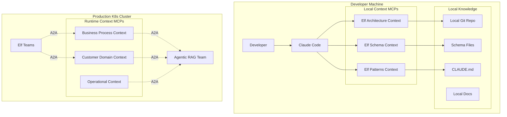

# Dual Context Architecture: Development vs Runtime

## The Two Context Domains

### 1. Development-Time Context (Local MCP)
**Purpose**: Assist developers (and AI IDEs) in building and extending ElfAutomations
**Location**: Runs locally on developer machines
**Consumers**: Claude Code, Cursor, GitHub Copilot

### 2. Runtime Context (Production MCP)
**Purpose**: Provide operational context to running Elf teams
**Location**: Runs in production Kubernetes cluster
**Consumers**: Executive Team, Product Teams, Customer-facing Teams

## Architecture Comparison



## Development-Time Context Implementation

### 1. Local File-Based MCP

```typescript
// dev-context-mcp/src/elf-development-context.ts
import { Server } from "@modelcontextprotocol/sdk/server/index.js";
import { GitRepoAnalyzer } from "./analyzers/git-repo.js";
import { SupabaseSchemaReader } from "./analyzers/supabase-schema.js";
import { PatternExtractor } from "./analyzers/pattern-extractor.js";

export class ElfDevelopmentContextMCP {
  private server: Server;
  private repoPath: string;
  private claudeMd: string;

  constructor() {
    this.repoPath = process.env.ELF_REPO_PATH || process.cwd();
    this.claudeMd = fs.readFileSync(path.join(this.repoPath, "CLAUDE.md"), "utf-8");

    this.server = new Server({
      name: "elf-development-context",
      version: "1.0.0"
    });

    this.setupTools();
  }

  private setupTools() {
    // Development-specific tools
    this.addTool({
      name: "get_elf_conventions",
      description: "Get ElfAutomations coding conventions and patterns",
      handler: async (args) => {
        // Read from CLAUDE.md and local pattern files
        const conventions = this.extractConventions();
        return this.formatConventions(conventions);
      }
    });

    this.addTool({
      name: "get_supabase_schema",
      description: "Get current Supabase schema for a table or all tables",
      handler: async (args) => {
        // Read from sql/ directory
        const schemas = await this.readSchemaFiles(args.table);
        return this.formatSchemas(schemas);
      }
    });

    this.addTool({
      name: "find_similar_implementations",
      description: "Find existing code that implements similar functionality",
      handler: async (args) => {
        // Search local codebase
        const examples = await this.searchCodebase(args.functionality);
        return this.formatExamples(examples);
      }
    });

    this.addTool({
      name: "get_team_patterns",
      description: "Get patterns for creating teams, agents, and workflows",
      handler: async (args) => {
        // Extract from existing teams/ directory
        const patterns = await this.analyzeTeamPatterns(args.type);
        return this.formatPatterns(patterns);
      }
    });
  }

  private async searchCodebase(functionality: string) {
    // Use ripgrep or similar to search local files
    const results = await this.ripgrep(functionality, {
      include: ["*.py", "*.ts", "*.md"],
      exclude: ["node_modules", ".git", "build"]
    });

    // Analyze and rank results
    return this.rankByRelevance(results, functionality);
  }
}
```

### 2. Enhanced CLAUDE.md Integration

```typescript
// dev-context-mcp/src/claude-md-parser.ts
export class ClaudeMdParser {
  parse(content: string): DevelopmentContext {
    const sections = this.extractSections(content);

    return {
      currentStatus: sections["Current Status"],
      keyDocuments: this.extractDocumentRefs(sections["Key Documents"]),
      completedWork: this.parseCompletedWork(sections["Completed Work"]),
      architectureDecisions: this.extractDecisions(sections),
      conventions: {
        fileStructure: this.extractPattern(sections, "File Structure Pattern"),
        namingConventions: this.extractNamingRules(sections),
        deploymentPatterns: this.extractDeploymentInfo(sections)
      },
      todos: this.extractTodos(sections)
    };
  }

  // Provide intelligent context based on what developer is working on
  getRelevantContext(workingOn: string): string[] {
    const parsed = this.parse(this.claudeMd);

    if (workingOn.includes("team")) {
      return [
        parsed.conventions.fileStructure,
        parsed.keyDocuments.teamFactory,
        ...this.findRelatedCompletedWork("team")
      ];
    }
    // ... more intelligent filtering
  }
}
```

### 3. Local Configuration

```json
// ~/.config/claude/mcp-settings.json
{
  "mcpServers": {
    "elf-development": {
      "command": "node",
      "args": ["/path/to/elf-dev-context-mcp/dist/index.js"],
      "env": {
        "ELF_REPO_PATH": "/Users/bryan/projects/ELFAutomations",
        "INCLUDE_GIT_HISTORY": "true",
        "SCHEMA_PATH": "/Users/bryan/projects/ELFAutomations/sql"
      }
    }
  }
}
```

## Runtime Context Implementation

This is the original Context-as-a-Service design, running in production:

```typescript
// runtime-context-mcp/src/business-process-context.ts
export class BusinessProcessContextMCP extends BaseContextMCP {
  constructor() {
    super({
      domain: "business-process",
      qdrantCollection: "business_processes",
      ragTeamEndpoint: "http://agentic-rag-team:8080"
    });
  }

  protected setupDomainHandlers() {
    this.addTool({
      name: "get_prd_template",
      description: "Get PRD template for specific project type",
      handler: async (args) => {
        // Query production RAG for business templates
        return await this.queryRAG({
          query: "PRD template " + args.projectType,
          collection: "business_templates"
        });
      }
    });

    this.addTool({
      name: "get_workflow_decision_criteria",
      description: "Determine when to use Teams vs N8N workflows",
      handler: async (args) => {
        // Query production knowledge base
        return await this.queryRAG({
          query: "workflow decision criteria " + args.useCase,
          collection: "operational_guidelines"
        });
      }
    });
  }
}
```

## Key Differences

### Development Context
- **Reads local files** (CLAUDE.md, schemas, code)
- **No network dependencies** (works offline)
- **Git-aware** (understands branches, history)
- **Fast and responsive** (local file access)
- **Developer-specific** (can have personal patterns)

### Runtime Context
- **Uses production RAG** (Qdrant + Neo4j)
- **A2A communication** with Agentic RAG Team
- **Shared knowledge** across all teams
- **Scalable** for production loads
- **Auditable** (all access logged)

## Implementation Strategy

### Phase 1: Development Context MCP
```bash
# Create local development context MCP
cd tools/dev-context-mcp
npm init
npm install @modelcontextprotocol/sdk

# Build tools for:
# - Schema introspection
# - Pattern extraction
# - Code search
# - Convention checking
```

### Phase 2: Enhance CLAUDE.md
```markdown
# CLAUDE.md Enhancement

## Quick Reference
<!-- Machine-readable section for MCP -->
### Database Tables
- teams: Stores team definitions
- team_members: Individual agents in teams
- n8n_workflows: Workflow definitions
...

### Patterns
- Team Creation: Use team_factory.py
- MCP Creation: Use mcp_factory.py
- A2A Communication: See /docs/patterns/a2a.md
...
```

### Phase 3: Runtime Context MCPs
Deploy the original Context-as-a-Service design for production use by Elf teams.

## Benefits of Dual Architecture

1. **Development Speed**: Local context = instant responses
2. **Offline Development**: No dependency on production systems
3. **Production Isolation**: Dev work doesn't impact production RAG
4. **Appropriate Scaling**: Each context scaled for its use case
5. **Clear Boundaries**: Development vs operational knowledge

This dual approach gives you the best of both worlds!
