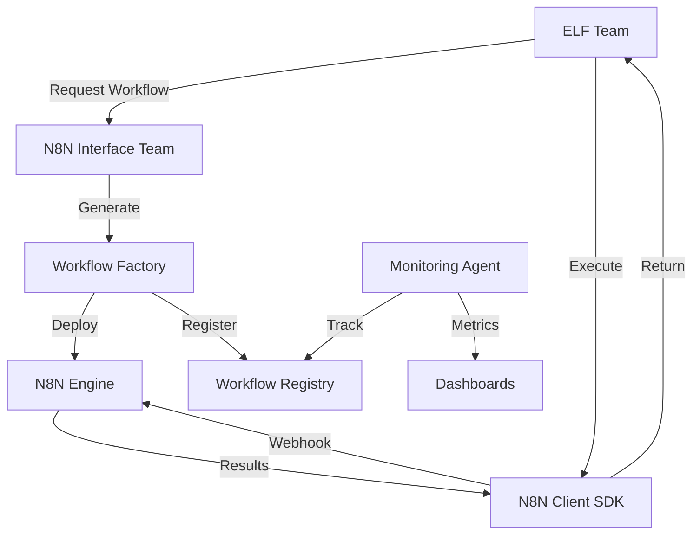

# Session Context: N8N Integration Planning

## Session Summary (June 17, 2025)

### What We Accomplished
1. **Fixed GitOps Pipeline**
   - Resolved elf-teams deployment issues
   - Created minimal team configuration
   - Established k8s/apps/ pattern for simplicity
   - Enabled auto-sync for all applications

2. **Current Deployments** (All Healthy & Auto-Syncing)
   - **Neo4j**: Graph database in elf-infrastructure
   - **n8n**: Workflow automation in n8n namespace
   - **elf-teams**: Minimal placeholder

3. **Documentation Created**
   - GitOps lessons learned
   - Current deployment inventory
   - ELF ecosystem roadmap
   - Team self-improvement architecture
   - DevOps team workflow example

4. **Key Learnings**
   - Simple combined.yaml files work best
   - Direct ArgoCD references to specific files
   - Avoid complex Kustomize setups
   - Shadow state must be prevented

## N8N Integration Vision

### Goal: Make n8n a First-Class ELF Capability

### Core Components Needed

#### 1. N8N Workflow Factory
```python
# tools/n8n_workflow_factory.py
class N8NWorkflowFactory:
    """
    Generates n8n workflows from high-level descriptions
    Similar to team_factory but for workflows
    """
    def create_workflow(self, description: str) -> dict:
        # Analyze requirements
        # Generate n8n JSON workflow
        # Register in system
        # Deploy to n8n
```

#### 2. Workflow Registry (Supabase)
```sql
CREATE TABLE n8n_workflows (
    id UUID PRIMARY KEY,
    name TEXT UNIQUE NOT NULL,
    description TEXT,
    category TEXT, -- 'data-pipeline', 'integration', 'automation'
    owner_team TEXT,
    n8n_workflow_id TEXT,
    trigger_type TEXT, -- 'webhook', 'schedule', 'manual'
    webhook_url TEXT,
    input_schema JSONB,
    output_schema JSONB,
    created_at TIMESTAMP DEFAULT NOW(),
    updated_at TIMESTAMP DEFAULT NOW(),
    is_active BOOLEAN DEFAULT true
);

CREATE TABLE workflow_executions (
    id UUID PRIMARY KEY,
    workflow_id UUID REFERENCES n8n_workflows(id),
    triggered_by TEXT, -- team name or system
    started_at TIMESTAMP,
    completed_at TIMESTAMP,
    status TEXT, -- 'running', 'success', 'failed'
    input_data JSONB,
    output_data JSONB,
    error_message TEXT
);
```

#### 3. N8N Interface Team
```yaml
Team: n8n-orchestrator-team
Purpose: Bridge between ELF teams and n8n workflows
Agents:
  - Workflow Architect (Manager)
  - Workflow Builder
  - Integration Specialist
  - Monitoring Agent
Capabilities:
  - Create workflows on demand
  - Execute workflows for other teams
  - Monitor workflow health
  - Optimize workflow performance
```

#### 4. Workflow Wrapper/SDK
```python
# elf_automations/shared/n8n/client.py
class N8NClient:
    """SDK for teams to interact with n8n"""

    async def execute_workflow(self, workflow_name: str, data: dict):
        # Find webhook URL from registry
        # Call n8n webhook
        # Track execution
        # Return results

    async def create_workflow(self, spec: WorkflowSpec):
        # Use factory to generate
        # Deploy to n8n via API
        # Register in system
```

#### 5. Common Workflow Templates
- **Data Pipeline**: Fetch → Transform → Store
- **Integration**: System A → Process → System B
- **Notification**: Event → Format → Notify
- **Scheduled Task**: Cron → Execute → Report
- **Approval Flow**: Request → Review → Action

### Integration Architecture



### Implementation Phases

#### Phase 1: Basic Integration (Week 1)
- [ ] Create N8NClient SDK
- [ ] Set up workflow registry tables
- [ ] Create simple webhook execution
- [ ] Test with manual workflows

#### Phase 2: Workflow Factory (Week 2)
- [ ] Build workflow factory tool
- [ ] Create workflow templates
- [ ] Generate from descriptions
- [ ] Auto-registration system

#### Phase 3: Interface Team (Week 3)
- [ ] Create n8n-orchestrator-team
- [ ] Implement workflow creation agent
- [ ] Add monitoring capabilities
- [ ] Enable A2A integration

#### Phase 4: Advanced Features (Week 4+)
- [ ] Workflow composition (chains)
- [ ] Conditional branching
- [ ] Error handling patterns
- [ ] Performance optimization

### Key Design Decisions

1. **Workflows as Code**: Store workflow definitions in Git
2. **Registry Pattern**: Central registry for discovery
3. **Team Ownership**: Workflows owned by teams
4. **Webhook-First**: Primary trigger mechanism
5. **Async Execution**: Non-blocking for teams

### Example Use Cases

1. **Data Collection Pipeline**
   - Marketing team needs daily competitor analysis
   - N8N workflow scrapes data, processes, stores in Neo4j
   - Team receives summary via webhook

2. **Multi-System Integration**
   - Sales team updates in CRM
   - N8N workflow syncs to accounting
   - Notifications sent to relevant teams

3. **Scheduled Reports**
   - Executive team needs weekly metrics
   - N8N workflow aggregates from multiple sources
   - Formats and delivers report

### Questions to Address

1. How do we handle workflow versioning?
2. Should workflows be mutable or immutable?
3. How do we manage workflow credentials?
4. What's the approval process for new workflows?
5. How do we handle workflow failures?

### Next Session Focus

1. Start with N8NClient SDK implementation
2. Create workflow registry schema
3. Build simple workflow factory
4. Test end-to-end integration

### Current n8n Access
- Internal: `n8n.n8n.svc.cluster.local:5678`
- External: `<node-ip>:30678`
- Credentials: admin / elf-n8n-2024

This plan positions n8n as a powerful automation layer that all teams can leverage through a clean interface!
